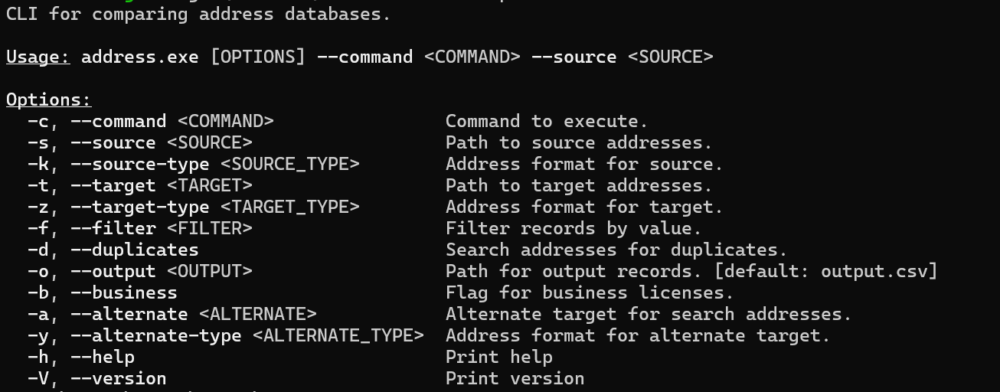
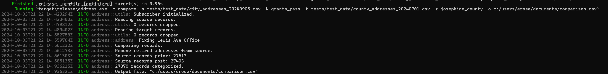

# Address Reconciliation

The addresses assigned by the City are primary used by other agencies delivering services to residents. Reconciliation is the process of comparing our addresses to the records of these partner agencies, and ensuring concordance. The agencies that we are primary interested in reconciling with are ECSO, the Josephine County Assessors Office, Pacific Power, Avista Gas and the two sanitation providers, Republic Services and Southern Oregon Sanitation. Prior to 2022, the city had no reconciliation process in place. As a consequent, differences between our records and our partner agencies had been slowly building over time, resulting in hundreds of discrepancies. In some cases, three different agencies had three different addresses recorded for a single location, making consensus elusive. As a consequence, our strategy is to focus on reconciliation one agency at a time. The order of importance is as follows:

- Emergency Communications of Southern Oregon (ECSO)
- Josephine County Assessors Office
- Pacific Power
- Avista Gas
- Republic Services
- Southern Oregon Sanitation

The process of reconciliation is as follows:

- For each address in our records, check to see if there is a matching record in the partner agency.
  - If all fields match, mark the address as "matching".
  - If the subaddress type, address status, floor number or building identifier do not match, we mark the address as "divergent".
  - If there is no match, mark the address as "missing".
  - Resolve all missing addresses.
    - Verify the validity of the address.
    - Submit an Address Verification notice to the partner agency.
    - Correct "divergent" addresses as practical.
- For each address of the partner agency within the UGB, check to see if there is a matching record in the city records.
  - Categorize addresses as "matching", "divergent" and "missing" as above.
  - Resolve all missing addresses from the partner agency.
    - Verify the validity of the address.
    - Add the missing address to the city records.
    - Complete an Address Verification notice and attach it to the "Notification" field of the address points layer.

We use the _address_ crate to perform the comparisons between addresses. With over 27k addresses in the city and 44k addresses in the county, we need to make over a billion comparisons each time we perform this check. Python proved to be a poor choice for this process, because the GIL prevents parallelization, resulting in poor performance. The _address_ crate, written in Rust, provides full parallelization and delivers adequate performance, permitting us to run the check almost instantaneously and get to work, as opposed to the Python version that took several hours to complete a full check.

## Using the AMS

The Address Management Software (AMS) provides a GUI interface that offers access to comparison methods of the _address_ crate. Loading data into the AMS involves a couple extra steps. First, the address record needs to have coordinate information included as fields available in the data, so that the AMS can determine how to display the points. The city address record does not include this coordinate information by default. The reason for this is to prevent the attached coordinate data from becoming out of date, although as I reflect on this, we could potentially use attribute rules to ensure the coordinate data is recalculated on update. The second hitch is that our address records are projected in the Grants Pass OCRS, while the AMS requires the EPSG:3857 (WGS 1984 Web Mercator - auxiliary sphere) projection. Here are the steps for exporting the address record to `.csv` from ArcPro:

- Export a copy of the address record to the local project GDB.
  - In the Environments tab, set Output Coordinate System to WGS 1984 Web Mercator (auxiliary sphere).
  - Use the Calculate Geometry Attributes tool to generate coordinates:
    - longitude - Point X in decimal degrees.
    - latitude - Point Y in decimal degrees.
    - x - Point X using Same as Input.
    - y - Point Y using Same as Input.
  - Export the feature layer to `.csv` file using Export Table.

Use the same steps for the ECSO address record. Note that the ECSO addresses include a latitude and longitude field, but these are not in the correct projection. You will need to recalculate the value in the latitude and longitude fields prior to export. You will also need to add the "x" and "y" fields containing the geographic coordinates.

### Convert addresses using Just

Convert address data from .csv into binary format using the `just` command runner. You may need to install this on your machine by running:

```{bash}
cargo install just
```

The 'justfile' containing the runner recipes for the `address` crate are in the parent directory for the repo. The commands in the runner assume that the AMS repo is in the same parent directory as the address repo. The commands use the CLI described [below](#using-the-address-cli) to run common workflows with greater ease.

To overwrite the city address data used by the AMS with data from a new `.csv` file, run the command:

```{bash}
just load_city <PATH>
```

Replace \<PATH\> with the file location of the `.csv` file you wish to import. The runner will load the `.csv` file and save the results under data/addresses.data in the AMS repo.

To overwrite the county address data used by the AMS with data from a new `.csv` file, run the command:

```{bash}
just load_county <PATH>
```

Replace \<PATH\> with the file location of the `.csv` file you wish to import. The runner will load the `.csv` file and save the results under data/county_addresses.data in the AMS repo.

Note the output from the program. If no records are dropped, then the read was successful. If all the records have been dropped, the program will refrain from overwriting the old record in the AMS and inform you that the save was aborted.

### Modify the `test` file to read your data

The script for reading `.csv` format into the AMS is within the `tests` folder. Eventually, the goal is to move this capability out into the user-facing API. The `tests` folder is located in the main repo directory [here](https://github.com/grantspassoregon/ams/tests/test_address.rs). To read in new data, you will modify the file path of the appropriate tests:

From _test_address.rs_ lines 48-55:

```{rust}
fn city_addresses() -> Clean<SpatialAddresses> {
    let addr = address::import::GrantsPassSpatialAddresses::from_csv(
        // Modify the path here to match the new file location
        "c:/users/erose/repos/address/tests/test_data/city_addresses_20240905.csv",
    )?;
    let addr = SpatialAddresses::from(&addr[..]);
    addr.save("data/addresses.data")?;
    Ok(addr)
}
```

From _test_address.rs_ lines 12-24:

```{rust}
#[test]
#[cfg_attr(feature = "ci", ignore)]
fn load_ecso_addresses() -> Clean<()> {
    utils::trace_init();

    trace!("Deserializing county addresses from a csv file.");
    // Modify the path here to match the new file location.
    let file = "tests/test_data/county_addresses_20240626.csv";
    let addresses = JosephineCountySpatialAddresses2024::from_csv(file)?;
    // Disable the assertion, since the length of addresses will be different.
    // assert_eq!(addresses.len(), 45252);
    trace!("ECSO addresses loaded: {} entries.", addresses.len());
    let mut spatial = SpatialAddresses::from(&addresses[..]);
    info!("Addresses loaded: {}", spatial.len());
    spatial.standardize();
    spatial.save("tests/test_data/county_addresses.data")?;
    Ok(())
}
```

## Using the _address_ CLI

Initially, we created a command line interface (CLI) for the _address_ crate. The program consumes the target address records in `.csv` format, and emits the results as a `.csv` table. This functionality is still available, accessed via the terminal using the `cargo` command. To see the available arguments, pass in the `--help` flag:

```{bash}
# from the working directory for the address crate
cargo run --release -- --help
```

Output:



When using the CLI, addresses do not have to be in the EPSG:3857 projection, because they will not be displayed. However, the layers do need to have the "longitude", "latitude", "x" and "y" fields as described in [Using the AMS](#using-the-ams).

To compare addresses, we pass the "compare" command using the `-c` flag. For each operation, we are comparing each address in the source records against addresses in the target records, looking for a match. Both the source and target records should be in `.csv` format. Since different address sources have different schema, we need to identify the address source associated with the source and target records. Use the `-k` and `-z` flags to specify the source and target types respectively. Currently, the program recognizes the discriminators "grants_pass" to refer to the city as a source and "josephine_county" to refer to ECSO as a source. Use the `-o` flag to specify the file name and location at which to output the results. Here is an example call:

```{bash}
cargo run --release -- -c compare -s tests/test_data/city_addresses_20240909.csv -k grants_pass -t tests/test_data/county_addresses_20240701.csv -z josephine_county -o c:/users/erose/documents/comparison.csv
```

Output:



The comparison file produced will contain matching, divergent and missing addresses. Typically I want to focus on the missing addresses first. For this, we can use the _filter_ command. Use the `-f` flag to set the value of the filter, which takes the values _matching_, _divergent_ and _missing_, as well as _subaddress_, _floor_, _building_ and _status_. The first three values will filter for records of these types. The other values are "mismatch fields". The filter operation will return records that contain a mismatch in the given field, useful for focused cleanup of divergent addresses. Following the previous example, here is how I would filter for missing addresses:

```{bash}
cargo run --release -- -c filter -s c:/users/erose/documents/comparison.csv -f missing -o c:/users/erose/documents/missing.csv
```

As before, we use the `-o` flag to specify the name and location of the output file.

Some things to bear in mind:

- Both source and target addresses need to share a common projection.
- Remember to clip the county addresses to the UGB when using it as the source.
  - When using county addresses as the target, we use the whole set because the city tracks a number of addresses outside our UGB.
