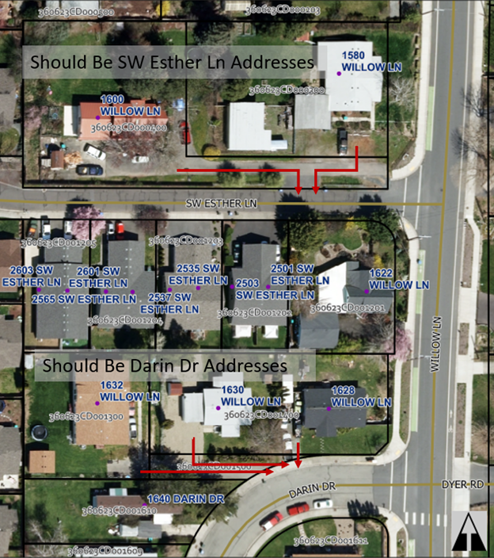
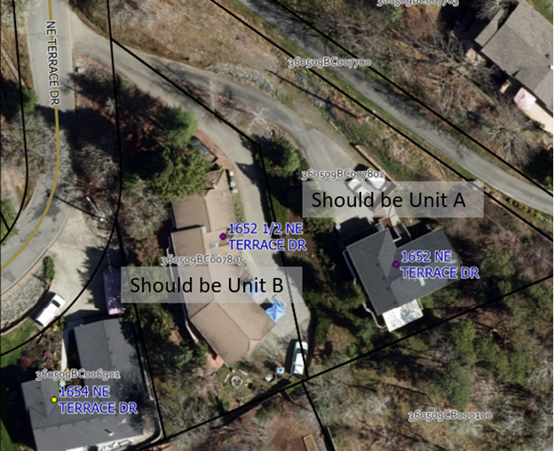
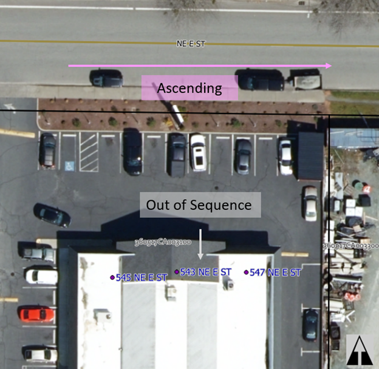

# 2024 Address Strategic Plan

The Address Strategic Plan identifies issues related to existing addresses, and serves as a planning document for developing policies and strategies for resolving these issues. Address issues fall into five broad categories:

- Deprecated street names
- Address number suffixes
- Out-of-sequence numbering
- Inaccurate directional designation
- Incorrect Parity
- Inaccurate street name post type
- Inaccurate parcel situs address

Deprecated street names refer to addresses where the street name no longer corresponds to the street providing access to the property, and these present a concern for emergency response. Emergency responders expect the street name of the address to correspond to the named public street that provides primary access to the property.

Address number suffixes, an identifier modifying the address number such as 1/2 or 3/4, present an issue for emergency responders because the computer-aided dispatch system used by emergency response does not recognize address number suffixes.

Out-of-sequence numbering refers to address numbers that do not adhere to the numbering sequence established in the block. According to the municipal code, address numbers should increase monotonically as they get farther from the city center.

The ostensible purpose of directional designations is to help orient emergency responders navigating the city at night, but unlike the previous issues, the problems with inaccurate directional designations do not originate from emergency response issues. In this case the assessor’s office differs from the City in recorded directional designation for hundreds of parcel situs addresses, and this document aims to provide clear process by which to change or confirm the directional designation of a street.

Incorrect parity means that the address number is odd when it should have been even, or vice versa.
While there is some room for interpretation of alignment for curvilinear streets, it is still possible to get the parity wrong.
The perceived risk from incorrect parity is fairly low for an individual property, but if parity is not standardized, then we lose the ability to use parity as a way to orient and direct emergency responders.
So correcting violations in parity rules helps to protect the efficacy of this strategy.

Inaccurate street name post type means that the assigned predirectional of the address does not match the official road name, as determined by the final plat.

Inaccurate parcel situs address indicates that the parcel situs address does not match the city record and should be updated.

## Address Issues

### Issue: Deprecated Street Names

Affected addresses:

- 22 & 1007 SW Elm St, 1580, 1600, 1628, 1630 & 1632 Willow Ln;
- 271 Fruitdale Dr, 271 Fruitdale Dr Unit D, 275 & 301 Fruitdale Dr;

Description: The City vacated SW Elm St in 1988, and yet two properties still have SW Elm St addresses, even though SW Elm St no longer exists (see Figure 1).
These addresses came to staff attention because of delays and confusion experienced during emergency response.
When SW Elm St was vacated, it was not removed from the City transportation map.
As a result, the CAD system routed emergency response vehicles through the former SW Elm St, who discovered it is now a gated private drive blocking access.
Existing SW Elm St addresses (22 and 1007 SW Elm St) need to be reassigned addresses using street names consistent with their primary access, defined as the first public street providing access to their private driveway.

The primary access to a property can change as development density increases.
Addresses that relied on a long private driveway to access a public road may find new access streets become available as a result of subdivisions created nearby.
In the case of 1630 Willow Ln, the creation of the Willow Glen Subdivision resulted in part of their private drive becoming Darin Dr, and now their primary access has changed from Willow Ln to Darin Dr, necessitating a change to a Darin Dr address.
Likewise, 1580 & 1600 Willow Ln previously took primary access from Willow Ln, but now take access from Esther Ln, and should receive Esther Ln addresses (see Figure 2).

The properties with Fruitdale Dr assignments take primary access from either Poplar Dr or Canal Ln.

### Issue: Address Number Suffixes (½ and ¾)

Affected Addresses: 42 properties total.

Description: An address number suffix is a modifier following an address number that is part of the complete address number, such as ½ or ¾.
Historically, the City assigned an address number suffix when there was insufficient spacing in the street number sequencing to accommodate additional density.
Periodically we receive complaints from 911 emergency response that they cannot create a response ticket for an address because their computer aided dispatch (CAD) system is not set up to accommodate address number suffixes.
As a consequence, we do not issue new addresses with an address number suffix.
This document tracks existing addresses with address number suffixes, with the goal of reassigning addresses that are valid and compatible with the emergency response CAD system.

There are currently 21 properties with address number suffixes that need new address assignments.
Because these addresses originate in locations where tight number sequencing does not permit assignment of a unique address number, both the property with the address number suffix assigned and the neighboring property with the shared address number would likely need to be reassigned to prevent ambiguity.
For instance, if we changed 305 ½ SE H ST to 305 SE H ST UNIT B, we would also have to change 305 SE H ST to 305 SE H ST UNIT A.

For every house with an address number suffix that we fix, there is a neighboring house with an otherwise valid address that also needs to be changed to accommodate the infill, meaning to fix 21 addresses we may need to change 42 in total (see Figure 3).
The reason for changing both addresses comes from the proposed code amendment, 6.40.030 (F): “Addresses shall be unique and unambiguous: If an address includes a subaddress identifier (unit number or letter), other buildings or portions of a building sharing the parent address shall also bear a unique identifier (100 E Park St A & B, not 100 E Park St and 100 E Park St A).”

### Issue: Out of Sequence Numbering

Affected Addresses: 543-547 NE E ST

Description: This is a straightforward case where the address numbers fail to increase monotonically as distance from the city center increases, going from 545 down to 543, then up to 547 (see Figure 4).
Note that in this case we cannot switch 543 and 545 to resolve the issue because 543 also happens to be a duplicate address.
The reason this is difficult to resolve without the proposed language change is that changing the out-of-sequence value (543) involves also changing a neighboring address that by itself violates no addressing rules.
There being no even numbers between 545 and 547, either one or the other could adopt unit numbers (eg. 545 NE E ST UNITS A & B), or one could change its address number in addition (eg. 543 changing to 547, and the current 547 changing to 549).

### Issue: Inaccurate Directional Designations

Description: From 1950-2023, GPMC 6.40.030 (B) specified that new streets shall receive a directional designation of NE, NW, SE or SW, but historically this standard was not consistently applied.
In some cases, the City failed to apply a directional designation, but the assessor’s office assumed one was in place, resulting in parcel situs addresses that do not match the addresses assigned by the City.
In other cases, the City has consistently applied a directional designation but the assessor’s office has not followed suit.

Affected Streets:

- NW MORGAN LN -> MORGAN LN
- NW VALLEY VIEW DR -> VALLEY VIEW DR
- NW HIGHLAND AVE -> HIGHLAND AVE
- NW LAURELRIDGE PLACE -> LAURELRIDGE PLACE
- NW TAMARA CIR -> TAMARA CIR
- NW STARLITE PL -> STARLITE PL
- NW LAWNRIDGE AVE -> LAWNRIDGE AVE
- NW WILLIAMSBURG DR -> ?
- NW SUN VIEW PL -> SUN VIEW PL
- NE SCOVILLE RD -> SCOVILLE RD
- NE TOKAY HTS -> TOKAY HTS
- NE FOOTHILL BLVD -> FOOTHILL BLVD
- NE FAIRVIEW AVE -> FAIRVIEW AVE
- NE DUANE DR -> DUANE DR
- NE JOSEPHINE ST -> JOSEPHINE ST
- NE INDUSTRY DR -> ?
- W SCHUTZWOHL LN -> SCHUTZWOHL LN
- SW FOUNDRY ST -> FOUNDRY ST
- SW HUMANITY WAY -> HUMANITY WAY
- SW GREENWOOD AVE -> GREENWOOD ?
- SW MARION LN -> MARION LN
- SW HENDERSON LN -> HENDERSON LN
- SW WEST HARBECK RD -> W HARBECK RD
- SW GRANDVIEW AVE -> GRANDVIEW AVE
- SW WAGNER MEADOWS DR -> WAGNER MEADOWS DR
- SW LINCOLN RD -> LINCOLN RD
- SW DEVONSHIRE WAY -> DEVONSHIRE WAY
- SW BALSAM RD -> BALSAM RD
- SW GOLDEN ASPEN DR -> GOLDEN ASPEN DR
- SW STURGEON CT -> STURGEON CT
- SW GEORGE TWEED BLVD -> GEORGE TWEED BLVD
- SW ESTHER LN -> ESTHER LN
- SW IRONWOOD DR -> IRONWOOD DR
- SW GARDEN VALLEY WAY -> GARDEN VALLEY WAY
- SW WEBSTER RD -> WEBSTER RD
- SW ANDY GRIFFITH DR -> ANDY GRIFFITH DR
- SW AUNT BEA WAY -> AUNT BEA WAY
- SW OPIE PLACE -> OPIE PLACE
- SW BARNEY FIFE DR -> BARNEY FIFE DR
- SW THELMA LOU LN -> THELMA LOU LN
- SW RAMSEY AVENUE -> RAMSEY AVE
- SW SUNNY SLOPE DR -> SUNNY SLOPE DR
- SW FORESTVIEW DR -> FORESTVIEW DR
- SW FLORER DR -> FLORER DR
- SE OAKVIEW DR -> OAKVIEW DR
- SE HILLTOP VW -> HILLTOP VW
- SE SOUTHRIDGE WAY -> SOUTHRIDGE WAY
- SE VISTA DR -> VISTA DR
- SE JERRINE ST -> JERRINE ST
- SE GRANDVIEW AVE -> GRANDVIEW AVE
- SE HAVILAND DR -> HAVILAND DR
- SE BRANDY LN -> BRANDY LN
- SE POPPY LN -> POPPY LN
- SE NEBRASKA AVE -> NEBRASKA AVE
- SE KRONER LN -> KRONER LN
- SE LILLIAN CT -> LILLIAN CT
- ACACIA LN -> SE ACACIA LN
- DAHLIA WAY -> SW DAHLIA WAY

#### NW MORGAN LN -> MORGAN LN

Affected Addresses: 85

Finding: This street was platted as "MORGAN LANE" as early as 1972 and does not have the "NORTHWEST" directional designation.

Evidence:

- Final Plat: [Morgan Estates](https://www.grantspassoregon.gov/DocumentCenter/View/31779/MORGAN-ESTATES?bidId=)
- Final Plat: [Oak View Subdivision](https://www.grantspassoregon.gov/DocumentCenter/View/31585/OAK-VIEW-SUBDIVISION?bidId=)
- Final Plat: [Highland View Subdivision](https://www.grantspassoregon.gov/DocumentCenter/View/31856/HIGHLAND-VIEW-SUBDIVISION?bidId=)
- Final Plat: [Laurelridge Subdivision - Phase 1](https://www.grantspassoregon.gov/DocumentCenter/View/31457/LAURELRIDGE-SUBDIVISION-PHASE-1?bidId=)
- Final Plat: [Donovan Court Subdivision](https://www.grantspassoregon.gov/DocumentCenter/View/31977/DONOVAN-COURT-SUBDIVISION?bidId=)

Options:

- Change addresses to match the official street name.
  - Addresses affected: 85
  - Titles affected: 51
- Add "NW" to the official street name per GPMC 6.40.020(D).
  - Addresses affected: 0
  - Titles affected: 2

Recommendation: Add "NW" to the official street name. The majority of parcel situs addresses already match the city-assigned address, so changing the street name minimizes disruption to only two titles.

#### NW VALLEY VIEW DR -> VALLEY VIEW DR

Affected Addresses: 59

Finding: This street was first platted as "VALLEY VIEW DRIVE" in 1947 and does not have the "NORTHWEST" directional designation.

Evidence:

- Final Plat: [Valley View Subdivision](https://www.grantspassoregon.gov/DocumentCenter/View/31734/VALLEY-VIEW-SUBDIVISION?bidId=)
- Final Plat: [Laurelridge Subdivision - Phase 1](https://www.grantspassoregon.gov/DocumentCenter/View/31457/LAURELRIDGE-SUBDIVISION-PHASE-1?bidId=)
- Final Plat: [Laurelridge Subdivision - Phase 2](https://www.grantspassoregon.gov/DocumentCenter/View/31698/LAURELRIDGE-SUBDIVISION-PHASE-2?bidId=)
- Final Plat: [Candler Heights Subdivision](https://www.grantspassoregon.gov/DocumentCenter/View/31720/CANDLER-HEIGHTS-SUBDIVISION?bidId=)

Options:

- Change addresses to match the official street name.
  - Addresses affected: 59
  - Titles affected: 52
    - 3 with situs "\* NW VALLEY VIEW DR"
- Add "NW" to the official street name per GPMC 6.40.020(D).
  - Addresses affected: 0
  - Titles affected: 7

Recommendation: Add "NW" to the official street name.

#### NW HIGHLAND AVE -> HIGHLAND AVE

Affected Addresses: 253

Finding: This street was platted as "Highland Avenue" in 1946 as part of the Sunset Heights Addition, and does not have a directional designation.

Evidence:

- [Sunset Heights Addition](https://www.grantspassoregon.gov/DocumentCenter/View/31932/SUNSET-HEIGHTS-ADDITION?bidId=) - "Highland Avenue" 1946
- [Valley View Subdivision](https://www.grantspassoregon.gov/DocumentCenter/View/31734/VALLEY-VIEW-SUBDIVISION?bidId=) - "Highland Avenue" 1947
- [Wall Subdivision](https://www.grantspassoregon.gov/DocumentCenter/View/31618/WALL-SUBDIVISION?bidId=) - "Highland Avenue" 1963
- [Highland Heights Subdivision](https://www.grantspassoregon.gov/DocumentCenter/View/31514/HIGHLAND-HEIGHTS-SUBDIVISION?bidId=) - "Highland Avenue" 1963
- [Hewitt Subdivision](https://www.grantspassoregon.gov/DocumentCenter/View/31501/HEWITT-SUBDIVISION?bidId=) - "Highland Avenue" 1965
- [North Hill Subdivision](https://www.grantspassoregon.gov/DocumentCenter/View/31864/NORTH-HILL-SUBDIVISION?bidId=) - "Highland Avenue" 1965
- [Kehr Subdivision](https://www.grantspassoregon.gov/DocumentCenter/View/31843/KEHR-SUBDIVISION?bidId=) - "Highland Avenue" 1967
- [Morgan Estates](https://www.grantspassoregon.gov/DocumentCenter/View/31779/MORGAN-ESTATES?bidId=) - "Highland Avenue" 1972
- [Lydia Heights Subdivision](https://www.grantspassoregon.gov/DocumentCenter/View/31835/LYDIA-HEIGHTS-SUBDIVISION?bidId=) - "Highland Avenue" 1974
- [Oak View Subdivision](https://www.grantspassoregon.gov/DocumentCenter/View/31585/OAK-VIEW-SUBDIVISION?bidId=) - "Highland Avenue" 1977
- [Ventura Subdivision](https://www.grantspassoregon.gov/DocumentCenter/View/31831/VENTURA-SUBDIVISION?bidId=) - "Highland Avenue" 1978
- [Windsor Village Partitiion](https://www.grantspassoregon.gov/DocumentCenter/View/31496/WINDSOR-VILLAGE-MAJOR-LAND-PARTITION?bidId=) - "Highland Avenue" 1982
- [Highland View Subdivision](https://www.grantspassoregon.gov/DocumentCenter/View/31856/HIGHLAND-VIEW-SUBDIVISION?bidId=) - "Highland Avenue" 1988
- [Victoria Estates Subdivision](https://www.grantspassoregon.gov/DocumentCenter/View/31510/VICTORIA-ESTATES-SUBDIVISION?bidId=) - "Highland Avenue" 1990
- [Woodbrook Estates Subdivision Phase 1](https://www.grantspassoregon.gov/DocumentCenter/View/31827/WOODBROOK-ESTATES-SUBDIVISION-PHASE-1?bidId=) - "Highland Avenue" 1991
- [Lucky Find Subdivision](https://www.grantspassoregon.gov/DocumentCenter/View/31924/LUCKY-FIND-SUBDIVISION-?bidId=) - "Highland Avenue" 1991
- [Cooke Estates Subdivision](https://www.grantspassoregon.gov/DocumentCenter/View/31446/COOKE-ESTATES-SUBDIVISION-PHASE-3?bidId=) - "Highland Avenue" 1996
- [Highland Meadows Subdivision](https://www.grantspassoregon.gov/DocumentCenter/View/31808/HIGHLAND-MEADOWS-SUBDIVISION?bidId=) - "Highland Avenue" 2008
- [Castle Heights Subdivision](https://www.grantspassoregon.gov/DocumentCenter/View/31486/CASTLE-HEIGHTS-SUBDIVISION?bidId=) - "Highland Avenue" 2008
- [Glidewell Estates](https://www.grantspassoregon.gov/DocumentCenter/View/31540/GLIDEWELL-ESTATES?bidId=) - "Highland Avenue" 2020
- [Highland Meadows Subdivision Phase 2](https://www.grantspassoregon.gov/DocumentCenter/View/31674/HIGHLAND-MEADOWS-SUBDIVISION-PHASE-2?bidId=) - "Highland Avenue" 2021

Options:

- Change addresses to match the official street name: Highland Avenue.
  - Addresses affected: 253
  - Titles affected: 124
- Add "NW" to the official street name per GPMC 6.40.020(D): NW Highland Avenue.
  - Addresses affected: 0
  - Titles affected: 4

Recommendation: Add "NW" to the official street name. This options minimizes disruption to residents.

#### NW LAURELRIDGE PL -> LAURELRIDGE PL

Addresses Affected: 7

Finding: This street was platted as "LAURELRIDGE PLACE" in 1998 as part of the Laurelridge Subdivision.

Evidence:

- Final Plat: [Laurelridge Subdivision - Phase 1](https://www.grantspassoregon.gov/DocumentCenter/View/31457/LAURELRIDGE-SUBDIVISION-PHASE-1?bidId=)

Options:

- Change addresses to match the official street name.
  - Addresses affected: 7
  - Titles affected: 6
- Add "NW" to the official street name per GPMC 6.40.020(D).
  - Addresses affected: 0
  - Titles affected: 1

Recommendation: Add "NW" to the official street name. This options minimizes disruption to residents.

#### NW TAMARA CIR -> TAMARA CIR

Affected Addresses: 4

Finding: This street was platted as "TAMARA CIRCLE" in 1978 and does not have the "NORTHWEST" directional designation.

Evidence:

- Final Plat: [Ventura Subdivision](https://www.grantspassoregon.gov/DocumentCenter/View/31831/VENTURA-SUBDIVISION?bidId=)

Options:

- Change addresses to match the official street name.
  - Addresses affected: 4
  - Titles affected: 1
- Add "NW" to the official street name per GPMC 6.40.020(D).
  - Addresses affected: 0
  - Titles affected: 3

Recommendation: Add "NW" to the official street name. This option minimizes disruption to residents and matches city preference for using directional designations.

#### NW STARLITE PL -> STARLITE PL

Addresses Affected: 70

Finding: This street was platted as "STARLITE PLACE" in 1963 as part of the Kehr Subdivision.

Evidence:

- Final Plat: [Kehr Subdivision](https://www.grantspassoregon.gov/DocumentCenter/View/31843/KEHR-SUBDIVISION?bidId=)
- Final Plat: [Starlite Subdivision](https://www.grantspassoregon.gov/DocumentCenter/View/31938/STARLITE-SUBDIVISION?bidId=)
- Final Plat: [Laurelridge Subdivision - Phase 3](https://www.grantspassoregon.gov/DocumentCenter/View/31796/LAURELRIDGE-SUBDIVISION-PHASE-3?bidId=)

Options:

- Change the addresses to match the official street name.
  - Addresses affected: 70
  - Titles affected: 73
    - 5 with situs "\* NW STARLITE PL"
- Add the "NW" directional designation to the official street name per GPMC 6.40.020(D).
  - Addresses affected: 0
  - Titles affected: 0

Recommendation: Add "NW" to the official street name. This option minimizes disruption to residents and matches city preference for using directional designations.

#### NW LAWNRIDGE AVE -> LAWNRIDGE AVE

Addresses Affected: 72

Finding: This street was platted as "LAWNRIDGE AVENUE" in 1910 as part of the Lincoln Park Addition.

Evidence:

- Final Plat: [Lincoln Park Addition](https://www.grantspassoregon.gov/DocumentCenter/View/31760/LINCOLN-PARK-ADDITION?bidId=)
- Final Plat: [Lawnridge Heights Addition](https://www.grantspassoregon.gov/DocumentCenter/View/31505/LAWNRIDGE-HEIGHTS-ADDITION-TO-GP?bidId=)

Options:

- Change the addresses to match the official street name.
  - Addresses affected: 72
  - Titles affected: 72
    - 1 with situs "\* NW LAWNRIDGE AVE"
- Add the "NW" directional designation to the official street name per GPMC 6.40.020(D).
  - Addresses affected: 0
  - Titles affected: 1

Recommendation: Add "NW" to the official street name. This option minimizes disruption to residents and matches city preference for using directional designations.

#### NW WILLIAMSBURG DR -> ?

Addresses Affected: 10

Finding: The final plats are contradictory for this street. In 1997 the street was platted as "WILLIAMSBURG DRIVE" in the Williamsburg Subdivision, but in 2023 the street was platted as "NORTHWEST WILLIAMSBURG DRIVE" in the Southview Subdivision Phase 2.

Evidence:

- Final Plat: [Williamsburg Subdivision](https://www.grantspassoregon.gov/DocumentCenter/View/31822/WILLIAMSBURG-SUBDIVISION?bidId=)
- Final Plat: [Southview Subdivision Phase 2](https://www.grantspassoregon.gov/DocumentCenter/View/31877/SOUTHVIEW-SUBDIVISION-PHASE-2?bidId=)

Options:

- Declare the official street name to be "WILLIAMSBURG DR".
  - Addresses affected: 10
  - Titles affected: 5
- Declare the official street name to be "NW WILLIAMSBURG DR".
  - Addresses affected: 0
  - Titles affected: 5

Recommendation: Add "NW" to the official street name. This option minimizes disruption to residents and matches city preference for using directional designations.

#### NW SUN VIEW PL -> SUN VIEW PL

Addresses Affected: 33

Finding: This road was platted as "Sun View Place" in 1967 as part of the Canyon Heights Subdivision, and does not have a directional designation. Later plats from Forest Hills Subdivision Phase 2 & 3 show "N.W. Sun View Place", but Forest Hills Subdivision Phase 1 shows "Sun View Place".

Evidence:

- [Canyon Heights Subdivision](https://www.grantspassoregon.gov/DocumentCenter/View/31773/CANYON-HEIGHTS-SUBDIVISION?bidId=) - "Sun View Place" 1967
- [Forest Hills Subdivision Phase 1] - "Sun View Place" 2004
- [Forest Hills Subdivision Phase 2](https://www.grantspassoregon.gov/DocumentCenter/View/31998/FOREST-HILLS-SUBDIVISION-PHASE-2?bidId=) - "N.W. Sun View Place" 2004
- [Forest Hills Subdivision Phase 3](https://www.grantspassoregon.gov/DocumentCenter/View/31551/FOREST-HILLS-SUBDIVISION-PHASE-3?bidId=) - "N.W. Sun View Place" 2004

Options:

- Declare the official street name to be "Sun View Place".
  - Addresses affected: 33
  - Titles affected: 33
    - Including one situs "\* NW Sun View Pl"
- Declare the official street name to be "NW Sun View Place".
  - Addresses affected: 0
  - Titles affected: 1

Recommendation: Add "NW" to the official street name. This option minimizes disruption to residents and matches city preference for using directional designations.

#### NE SCOVILLE RD -> SCOVILLE RD

Addresses Affected: 33

Finding: This street was platted as "SCOVILLE ROAD" as early as 1950 as part of the Oak Park Acres subdivision.

Evidence:

- Final Plat: [Oak Park Acres](https://www.grantspassoregon.gov/DocumentCenter/View/32037/OAK-PARK-ACRES?bidId=)

Options:

- Change the parcel situs addresses to match the official street name.
  - Addresses affected: 0
  - Titles affected: 6
- Add the "NE" directional designation to the official street name, per GPMC 6.40.020(D).
  - Addresses affected: 33
  - Titles affected: 30 (including three with situs "\* SCOVILLE RD")

Recommendation: Change the parcel situs addresses to match the official street name. This approach minimizes disruption to residents.

#### NE TOKAY HTS -> TOKAY HTS

Addresses Affected: 25

Finding: This street was platted "Tokay Heights" as early as 1991 in association with the Austin Heights Subdivision.

Evidence:

- Final Plat: [Austin Heights Subdivision](https://www.grantspassoregon.gov/DocumentCenter/View/31939/AUSTIN-HEIGHTS-SUBDIVISION?bidId=) - "Tokay Heights" 1991

Options:

- Change the addresses to match the official street name.
  - Addresses affected: 25
  - Titles affected: 30
    - 10 with situs "\* NE TOKAY HTS"
- Add the "NE" directional designation to the official street name per GPMC 6.40.020(D).
  - Addresses affected: 0
  - Titles affected: 1

Recommendation: Add the "NE" directional designation to the official street name. This option minimizes disruption to residents and matches city preference for using directional designations.

#### NE FOOTHILL BLVD -> FOOTHILL BLVD

Addresses Affected: 107

Finding: This street was platted as "FOOTHILL BOULEVARD" as early as 1957 as part of the Sovereign Knoll Addition.

Evidence:

- Final Plat: [Sovereign Knoll Addition](https://www.grantspassoregon.gov/DocumentCenter/View/31561/SOVEREIGN-KNOLL-ADDITION?bidId=)
- Final Plat: [New Sovereign Knoll Addition](https://www.grantspassoregon.gov/DocumentCenter/View/31741/SOVEREIGN-KNOLL-NEW-ADDITION?bidId=)
- Final Plat: [Foothill View Subdivision](https://www.grantspassoregon.gov/DocumentCenter/View/31893/FOOTHILL-VIEW-SUBDIVISION?bidId=)

Options:

- Change the addresses to match the official street name.
  - Addresses affected: 107
  - Titles affected: 53
- Add the "NE" directional designation to the official street name per GPMC 6.40.020(D).
  - Addresses affected: 0
  - Titles affected: 6

Recommendation: Add the "NE" directional designation to the official street name. This option minimizes disruption to residents. In addition, Foothill Blvd continues to the east, after transitioning through Agness Ave, where it crosses the UGB and travels through the county. Adding the "NE" directional will help to distinguish this portion of Foothill Blvd from the eastern portion, preventing confusion during response.

#### NE FAIRVIEW AVE -> FAIRVIEW AVE

Addresses Affected: 173

Finding: This street was platted as "FAIRVIEW AVENUE" as early as 1993 in the Fairview Estates PUD.

Evidence:

- Final Plat: [Fairview Estates PUD](https://www.grantspassoregon.gov/DocumentCenter/View/31518/FAIRVIEW-ESTATES-PUD?bidId=)
- Final Plat: [Fairview Commons PUD](https://www.grantspassoregon.gov/DocumentCenter/View/31456/FAIRVIEW-COMMONS-PUD?bidId=)
- Final Plat: [Cooper Estates Subdivision](https://www.grantspassoregon.gov/DocumentCenter/View/31703/COOPER-ESTATES-SUBDIVISION?bidId=)

Options:

- Change the address to match the official street name.
  - Addresses affected: 173
  - Titles affected: 48
- Add the "NE" directional designation to the official street name per GPMC 6.40.020(D)
  - Addresses affected: 0
  - Titles affected: 1 (Situs: 2084 FAIRVIEW)

Recommendation: Add the "NE" directional designation to the official street name. This option minimizes disruption to residents and matches city preference for using directional designations.

#### NE DUANE DR -> DUANE DR

Addresses Affected: 6

Finding: This street was platted as "DUANE DRIVE" in 1961 as part of the Hardenburger Subdivision.

Evidence:

- Final Plat: [Hardenburger Subdivision](https://www.grantspassoregon.gov/DocumentCenter/View/31838/HARDENBURGER-SUBDIVISION?bidId=)

Options:

- Change the address to match the official street name.
  - Addresses affected: 6
  - Titles affected: 6
- Add the "NE" directional designation to the official street name.
  - Addresses affected: 0
  - Titles affected: 0

Recommendation: Add the "NE" directional designation to the official street name. This option minimizes disruption to residents and matches city preference for using directional designations.

#### NE JOSEPHINE ST -> JOSEPHINE ST

Addresses Affected: 7

Finding: This street was platted as "JOSEPHINE STREET" in 1900 as part of the Moss Addition to GP.

Evidence:

- Final Plat: [Moss Addition to GP](https://www.grantspassoregon.gov/DocumentCenter/View/31453/MOSS-ADDITION-TO-GP?bidId=)

Options:

- Change the address to match the official street name.
  - Addresses affected: 7
  - Titles affected: 6
- Add the "NE" directional designation to the official street name.
  - Addresses affected: 0
  - Titles affected: 1

Recommendation: Add the "NE" directional designation to the official street name. This option minimizes disruption to residents and matches city preference for using directional designations.

#### NE INDUSTRY DR -> ?

Addresses Affected: 30

Finding: The street was platted as "NE INDUSTRY DR" as part of the Spalding Commerce Park Phase 2 in 2004, but the plat for Spalding Commerce Park Phase 3 shows "INDUSTRY DRIVE" in 2007.

Evidence:

- [Spalding Commerce Park Phase 2](https://www.grantspassoregon.gov/DocumentCenter/View/31547/SPALDING-COMMERCE-PARK-PHASE-2?bidId=) - "NE INDUSTRY DRIVE" 2004
- [Spalding Commerce Park Phase 3](https://www.grantspassoregon.gov/DocumentCenter/View/32041/SPALDING-COMMERCE-PARK-PHASE-3?bidId=) - "INDUSTRY DRIVE" 2007

Options:

- NE INDUSTRY DRIVE
  - Addresses affected: 0
  - Titles affected: 3
- INDUSTRY DRIVE
  - Addresses affected: 30
  - Titles affected: 9

Recommendation: Use "NE INDUSTRY DR". This option minimizes disruption to residents and matches city preference for using directional designations.

#### W SCHUTZWOHL LN -> SCHUTZWOHL LN

Addresses Affected: 3

Finding: No plat evidence for the western portion of Schutzwohl Ln.

Evidence:

Options:

- W SCHUTZWOHL LN
  - Addresses affected: 0
  - Titles affected: 2
- SCHUTZWOHL LN
  - Addresses affected: 3
  - Titles affected: 1

Recommendation: Use "W SCHUTZWOHL LN". The directional designation distinguishes this portion of the road from the eastern portion, which do not connect.

#### SW FOUNDRY ST -> FOUNDRY ST

Addresses Affected: 67

Finding: The City changed the name of the street from "North Main Street" to "Foundry Street" with Ord 281 in 1907.

Evidence:

- [Ord 281](./ord_281.md)
- Final Plat: [Roller Subdivision](https://www.grantspassoregon.gov/DocumentCenter/View/31467/ROLLER-SUBDIVISION?bidId=) - "Foundry Street" 1965
- Final Plat: [Habitat Haven Subdivision](https://www.grantspassoregon.gov/DocumentCenter/View/31825/HABITAT-HAVEN-SUBDIVISION?bidId=) - 2001

Options:

- Change the addresses to match the official street name.
  - Addresses affected: 67
  - Titles affected: 48
- Add the "SW" directional designation to the official street name.
  - Addresses affected: 0
  - Titles affected: 1

Recommendation: Add the "SW" directional designation to the official street name. This option minimizes disruption to residents and matches city preference for using directional designations.

#### SW HUMANITY WAY -> HUMANITY WAY

Addresses Affected: 5

Finding: This street was platted as "HUMANITY WAY" in 2001 as part of the Habitat Haven Subdivision.

Evidence:

- Final Plat: [Habitat Haven Subdivision](https://www.grantspassoregon.gov/DocumentCenter/View/31825/HABITAT-HAVEN-SUBDIVISION?bidId=) - 2001

Options:

- Change the addresses to match the official street name.
  - Addresses affected: 5
  - Titles affected: 4
- Add the "SW" directional designation to the official street name.
  - Addresses affected: 0
  - Titles affected: 1

Recommendation: Add the "SW" directional designation to the official street name. This option minimizes disruption to residents and matches city preference for using directional designations.

#### SW GREENWOOD AVE -> GREENWOOD ?

Addresses Affected: 68

Finding: Not sure if the street post type is "Drive" or "Avenue". No evidence of "SW" directional designation in use.

Evidence:

- [HB Miller & Company New Addition] - "West Side Street" 1889
- [Westholm Park Addition](https://www.grantspassoregon.gov/DocumentCenter/View/31527/WEST-L-STREET-SUBDIVISION?bidId=) - "Greenwood Drive" 1911
- [West L Street Subdivision](https://www.grantspassoregon.gov/DocumentCenter/View/31527/WEST-L-STREET-SUBDIVISION?bidId=) - "Greenwood Drive" 1949
- [Ballinger Subdivision](https://www.grantspassoregon.gov/DocumentCenter/View/31527/WEST-L-STREET-SUBDIVISION?bidId=) - "Greenwood Avenue" 1961

Options:

- SW GREENWOOD AVE
  - Addresses affected: 0
  - Titles affected: 1
- GREENWOOD AVE
  - Addresses affected: 68
  - Titles affected: 65
    - 1 with situs "\* SW GREENWOOD AVE"
- GREENWOOD DR
  - Addresses affected: 68
  - Titles affected: 66

Recommendation: Use "SW GREENWOOD AVE", adding the "SW" directional designation to the official street name. This option minimizes disruption to residents and matches city preference for using directional designations.

#### SW MARION LN -> MARION LN

Addresses Affected: 52

Finding: This street was platted as "Marion Street" in 1948 and then "Marion Lane" in 2006. No evidence of a directional designation.

Evidence:

- [Redland Manor Tracts](https://www.grantspassoregon.gov/DocumentCenter/View/31682/REDLAND-MANOR-TRACTS?bidId=) - "Marion Street" 1948
- [Westerly Meadows Subdivision](https://www.grantspassoregon.gov/DocumentCenter/View/31443/WESTERLY-MEADOWS-SUBDIVISION?bidId=) - "Marion Lane" 2006

Options:

- Change the addresses to match the official street name.
  - Addresses affected: 0
  - Titles affected: 39
    - 1 situs address with "\* SW MARION "
- Add the "SW" directional designation to the official street name.
  - Addresses affected: 52
  - Titles affected: 1

Recommendation: Change the addresses to match the official street name. This option minimizes disruption to residents.

#### SW HENDERSON LN -> HENDERSON LN

Addresses Affected: 3

Finding: The street was platted as "Henderson Lane" in 2004, and does not have a directional designation.

Evidence:

- [Westerly Meadows Subdivision](https://www.grantspassoregon.gov/DocumentCenter/View/31443/WESTERLY-MEADOWS-SUBDIVISION?bidId=) - "Henderson Lane" 2004
- [Ruhl Subdivision](https://www.grantspassoregon.gov/DocumentCenter/View/32002/RUHL-SUBDIVISION?bidId=) - "County Road" - 1949

Options:

- Change the address to match the official street name.
  - Addresses affected: 3
  - Titles affected: 1
- Add the "SW" directional designation to the official street name.
  - Addresses affected: 0
  - Titles affected: 1

Recommendation: Add the "SW" directional designation to the street name, matching the city preference for using directional designations.

#### SW WEST HARBECK RD -> WEST HARBECK RD

Addresses Affected: 109

Finding: Prior to 1978, this street was platted as "Harbeck Road", without a directional prefix, starting in 1959 with Jeddelohs First Subdivision. From 1978 onward, the plat name is "West Harbeck Road", beginning with the Colorado Subdivision.

Evidence:

- [Jeddelohs First Subdivision](https://www.grantspassoregon.gov/DocumentCenter/View/31479/JEDDELOHS-FIRST-SUBDIVISION?bidId=) - "Harbeck Road" 1959
- [Hobarts Subdivision](https://www.grantspassoregon.gov/DocumentCenter/View/31919/HOBARTS-SUBDIVISION?bidId=) - "Harbeck Road" 1959
- [Gix Subdivision](https://www.grantspassoregon.gov/DocumentCenter/View/31648/GIX-SUBDIVISION?bidId=) - "Harbeck Road" 1960
- [Colorado Subdivision](https://www.grantspassoregon.gov/DocumentCenter/View/31556/COLORADO-SUBDIVISION?bidId=) - "West Harbeck Road" 1978
- [Meadow Glen Subdivision](https://www.grantspassoregon.gov/DocumentCenter/View/31497/MEADOW-GLEN-SUBDIVISION-1ST-ADDITION?bidId=) - "West Harbeck Road" 1981
- [Sunset Knoll Subdivision Phase 1](https://www.grantspassoregon.gov/DocumentCenter/View/31672/SUNSET-KNOLL-SUBDIVISION-PHASE-1?bidId=) - "West Harbeck Road" 1991
- [Sunset Knoll Subdivision Phase 2](https://www.grantspassoregon.gov/DocumentCenter/View/31660/SUNSET-KNOLL-SUBDIVISION-PHASE-2?bidId=) - "West Harbeck Road" 1994
- [Sunset Knoll Subdivision Phase 3](https://www.grantspassoregon.gov/DocumentCenter/View/31445/SUNSET-KNOLL-SUBDIVISION-PHASE-3?bidId=) - "West Harbeck Road" 1995
- [Citys Edge Subdivision](https://www.grantspassoregon.gov/DocumentCenter/View/31807/CITYS-EDGE-SUBDIVISION?bidId=) - "West Harbeck Road" 1997
- [Countrywood Heights Subdivision](https://www.grantspassoregon.gov/DocumentCenter/View/31622/COUNTRYWOOD-HEIGHTS-SUBDIVISION?bidId=) - "West Harbeck Road" 1999
- [Maurer Meadows Subdivision](https://www.grantspassoregon.gov/DocumentCenter/View/31914/MAURER-MEADOWS-SUBDIVISION?bidId=) - "West Harbeck Road" 2003
- [Mayberry Meadows Subdivision](https://www.grantspassoregon.gov/DocumentCenter/View/31740/MAYBERRY-MEADOWS-SUBDIVISION?bidId=) - "West Harbeck Road" 2003
- [West Harbeck Place Subdivision](https://www.grantspassoregon.gov/DocumentCenter/View/31753/WEST-HARBECK-PLACE-SUBDIVISION?bidId=) - "West Harbeck Road" 2004
- [Countrywood East Subdivision](https://www.grantspassoregon.gov/DocumentCenter/View/31665/COUNTRYWOOD-EAST-SUBDIVISION?bidId=) - "West Harbeck Road" 2004

Options:

- HARBECK ROAD
  - Addresses affected: 109
  - Titles affected: 106
- WEST HARBECK ROAD
  - Addresses affected: 0
  - Titles affected: 69
- SW WEST HARBECK ROAD
  - Addresses affected: 109
  - Titles affected: 37

Recommendation: Use "West Harbeck Road". This option minimizes disruption to residents. The directional "West" helps to differentiate the east/west aligned portion from the north/west aligned portion.

#### SW GRANDVIEW AVE -> GRANDVIEW AVE

Addresses Affected: 22

Finding: The assessment map shows "Grandview Avenue". We have no final plat on record.

Evidence:

- [Assessment Map](https://alt.co.josephine.or.us/webapps/assessor/fetch-filedata.php?filetype=byaccount&identifier=R340042&inline=true) - "Grandview Avenue"

Options:

- Change the addresses to match the official street name: Grandview Ave
  - Addresses affected: 22
  - Titles affected: 3
- Add the "SW" directional designation to the official street name: SW Grandview Ave
  - Addresses affected: 0
  - Titles affected: 1

Recommendation: Add the "SW" directional designation to the official street name. This option minimizes disruption to residents and matches city preference for using directional designations. Grandview crosses Williams Hwy, the divisor between E and W directionals in the city. Using "SW" and "SE" helps to disambiguate between segments of Grandview.

#### SW WAGNER MEADOWS DR -> WAGNER MEADOWS DR

Addresses Affected: 32

Finding: This street was platted as "Wagner Meadows Drive" in 1996 as part of the Wagner Meadows Subdivision, and does not have a directional designation.

Evidence:

- [Wagner Meadows Subdivision](https://www.grantspassoregon.gov/DocumentCenter/View/31436/WAGNER-MEADOWS-SUBDIVISION?bidId=) - "Wagner Meadows Drive" 1996
- [Wagner Meadows Suvdivision 1st Addition](https://www.grantspassoregon.gov/DocumentCenter/View/31586/WAGNER-MEADOWS-SUBDIVISION-1ST-ADDITION?bidId=) - "Wagner Meadows Drive" 1998
- [Morningstar PUD](https://www.grantspassoregon.gov/DocumentCenter/View/31774/MORNINGSTAR-PUD?bidId=) - "Wagner Meadows Drive" 1998
- [Wagner Meadows Subdivision 2nd Addition](https://www.grantspassoregon.gov/DocumentCenter/View/31744/WAGNER-MEADOWS-SUBDIVISION-2ND-ADDITION?bidId=) - "Wagner Meadows Drive" 1999
- [Scenic Bayou Planned Community](https://www.grantspassoregon.gov/DocumentCenter/View/31534/SCENIC-BAYOU--PLANNED-COMMUNITY?bidId=) - "Wagner Meadows Drive" 2010
- [Heatherwood PUD](https://www.grantspassoregon.gov/DocumentCenter/View/31896/HEATHERWOOD-PUD?bidId=) - "Wagner Meadows Drive" 2011

Options:

- Change the addresses to match the official street name: Wagner Meadows Drive.
  - Addresses affected: 32
  - Titles affected: 28
- Add the "SW" directional designation to the official street name: SW Wagner Meadows Drive.
  - Addresses affected: 0
  - Titles affected: 5

Recommendation: Add the "SW" directional designation to the official street name. This option minimizes disruption to residents and matches city preference for using directional designations.

#### SW LINCOLN RD -> LINCOLN RD

Addresses Affected: 68

Finding: This street was platted as "Lincoln Road" in 1964 as part of the Neil Subdivision, and does not have a directional designation. The plat for Capital Hill Phase 2 shows both versions of the road name "S.W. Lincoln Road" and "Lincoln Road" in 2020.

Evidence:

- [Neil Subdivision](https://www.grantspassoregon.gov/DocumentCenter/View/31670/NEIL-SUBDIVISION?bidId=) - "Lincoln Road" 1964
- [Lower River Meadows Subdivision](https://www.grantspassoregon.gov/DocumentCenter/View/31506/LOWER-RIVER-MEADOWS-SUBDIVISION?bidId=) - "Lincoln Road" 1994
- [Garden Valley Estates](https://www.grantspassoregon.gov/DocumentCenter/View/31716/GARDEN-VALLEY-ESTATES-SUBDIVISION?bidId=) - "Lincoln Road" 1998
- [Morningstar Subdivision](https://www.grantspassoregon.gov/DocumentCenter/View/31774/MORNINGSTAR-PUD?bidId=) - "Lincoln Road" 1998
- [Lincoln Heights Subdivision](https://www.grantspassoregon.gov/DocumentCenter/View/31969/LINCOLN-HEIGHTS-SUBDIVISION?bidId=) - "Lincoln Road" 2001
- [Parkside Estates Subdivision](https://www.grantspassoregon.gov/DocumentCenter/View/31666/PARKSIDE-ESTATES-SUBDIVISION?bidId=) - "Lincoln Road" 2003
- [Lincoln Meadows Subdivision](https://www.grantspassoregon.gov/DocumentCenter/View/31701/LINCOLN-MEADOWS-SUBDIVISION?bidId=) - "Lincoln Road" 2005
- [Lincoln Acres Subdivision](https://www.grantspassoregon.gov/DocumentCenter/View/32008/LINCOLN-ACRES-SUBDIVISION?bidId=) - "Lincoln Road" 2007
- [Capital Hill Phase 1](https://www.grantspassoregon.gov/DocumentCenter/View/31765/CAPITAL-HILL-PHASE-1?bidId=) - "Lincoln Road" 2016
- [All-Sports Park Subdivision](https://www.grantspassoregon.gov/DocumentCenter/View/31809/ALL-SPORTS-PARK-SUBDIVISION?bidId=) - "Lincoln Road" 2018
- [Capital Hill Phase 2](https://www.grantspassoregon.gov/DocumentCenter/View/31450/CAPITAL-HILL-PHASE-2?bidId=) - "S.W. Lincoln Road" & "Lincoln Road" 2020

Options:

- Change the addresses to match the official street name: Lincoln Road.
  - Addresses affected: 0
  - Titles affected: 3
- Add the "SW" directional designation to the official street name: SW Lincoln Road.
  - Addresses affected: 68
  - Titles affected: 59

Recommendation: Change the addresses to match the official street name. This option minimizes disruption to residents.

#### SW BALSAM RD -> BALSAM RD

Addresses Affected: 15

Finding: This street was platted as "Balsam Road" in 1994 as part of the Lower River Meadows Subdivision.

Evidence:

- [Lower River Meadows Subdivision](https://www.grantspassoregon.gov/DocumentCenter/View/31506/LOWER-RIVER-MEADOWS-SUBDIVISION?bidId=) - "Balsam Road" 1994
- [Lower River Meadows Subdivision Phase 2](https://www.grantspassoregon.gov/DocumentCenter/View/32007/LOWER-RIVER-MEADOWS-SUBDIVISION-PHASE-2?bidId=) - "Balsam Road" 1994
- [Westview Court Subdivision](https://www.grantspassoregon.gov/DocumentCenter/View/32030/WESTVIEW-COURT-SUBDIVISION?bidId=) - "Balsam Road" 1996

Options:

- Change the addresses to match the official street name: Balsam Road.
  - Addresses affected: 0
  - Titles affected: 11
- Add the "SW" directional designation to the official street name: SW Balsam Road.
  - Addresses affected: 15
  - Titles affected: 0

Recommendation: Change the addresses to match the official street name. This option minimizes disruption to residents.

#### SW DEVONSHIRE WAY -> DEVONSHIRE WAY

Affected Addresses: 22

Finding: This street was platted as "Devonshire Way" in 2001 as part of the Southdown Estates Subdivision, and does not have a directional designation.

Evidence:

- [Southdown Estates Subdivision](https://www.grantspassoregon.gov/DocumentCenter/View/31631/SOUTHDOWN-ESTATES-SUBDIVISION?bidId=) - "Devonshire Way" 2001
- [Johnson Estates](https://www.grantspassoregon.gov/DocumentCenter/View/31935/JOHNSON-ESTATES?bidId=) - "Devonshire Way" 2022

Options:

- Change the addresses to match the official street name: Devonshire Way.
  - Addresses affected: 0
  - Titles affected: 1
- Add the "SW" directional designation to the official street name: SW Devonshire Way.
  - Addresses affected: 22
  - Titles affected: 21
    - Including one situs at "\* DEVONSHIRE WAY"

Recommendation: Change the addresses to match the official street name. This option minimizes disruption to residents.

#### SW GOLDEN ASPEN DR -> GOLDEN ASPEN DR

Addresses Affected: 14

Finding: This street was platted as "Golden Aspen Drive" in 2000 as part of the Aranaway Subdivision.

Evidence:

- [Aranaway Subdivision](https://www.grantspassoregon.gov/DocumentCenter/View/31960/ARANAWAY-SUBDIVISION?bidId=) - "Golden Aspen Drive" 2000

Options:

- Change the addresses to match the official street name: Golden Aspen Drive.
  - Addresses affected: 14
  - Titles affected: 0
- Add the "SW" directional designation to the official street name: SW Golden Aspen Drive.
  - Addresses affected: 0
  - Titles affected: 14

Recommendation: Add the "SW" directional designation to the street name. This option matches the city preference for using directional designations.

#### SW STURGEON CT -> STURGEON CT

Addresses Affected: 55

Finding: This street was platted as "Sturgeon Court" in 2005, and does not have a directional designation. In 2022, the plat for the Blackberry Glen Subdivision Phase 2 designates a portion of Sturgeon Ct as "SW Sturgeon Ct".

Evidence:

- [Prairie Glen Subdivision](https://www.grantspassoregon.gov/DocumentCenter/View/31766/PRAIRE-GLEN-SUBDIVISION?bidId=) - "Sturgeon Court" 2005
- [Redwood Subdivision 1st Addition](https://www.grantspassoregon.gov/DocumentCenter/View/31847/REDWOOD-SUBDIVISION-1ST-ADDITION?bidId=) - "Sturgeon Court" 2005
- [Blackberry Glen Subdivision Phase 2](https://www.grantspassoregon.gov/DocumentCenter/View/31449/BLACKBERRY-GLEN-SUBDIVISION-PHASE-2?bidId=) - "S.W. Sturgeon Court" & "Sturgeon Court" 2022

Options:

- Change the addresses to match the official street name: Sturgeon Court.
  - Addresses affected: 55
  - Titles affected: 53
- Add the "SW" directional designation to the official street name: SW Sturgeon Court.
  - Addresses affected: 0
  - Titles affected: 2

Recommendation: Add the "SW" directional designation to the street name. This option minimizes disruption to residents and matches the city preference for using directional designations.

#### SW GEORGE TWEED BLVD -> GEORGE TWEED BLVD

Addresses Affected: 75

Finding: This street was platted as "George Tweed Boulevard" in 2002 as part of the Nunnwood Subdivision.

Evidence:

- [Nunnwood Subdivision](https://www.grantspassoregon.gov/DocumentCenter/View/32024/NUNNWOOD-SUBDIVISION?bidId=) - "George Tweed Boulevard" 2002
- [Speelman Subdivision](https://www.grantspassoregon.gov/DocumentCenter/View/32013/SPEELMAN-SUBDIVISION?bidId=) - "George Tweed Boulevard" 2004
- [Redwood Subdivision](https://www.grantspassoregon.gov/DocumentCenter/View/31904/REDWOOD-SUBDIVISION?bidId=) - "George Tweed Boulevard" 2004
- [Redwood Subdivision 1st Addition](https://www.grantspassoregon.gov/DocumentCenter/View/31847/REDWOOD-SUBDIVISION-1ST-ADDITION?bidId=) - "George Tweed Boulevard" 2005
- [Redwood Subdivision 2nd Addition](https://www.grantspassoregon.gov/DocumentCenter/View/31440/REDWOOD-SUBDIVISION-2ND-ADDITION-?bidId=) - "George Tweed Boulevard" 2005
- [Prairie Glen Subdivision](https://www.grantspassoregon.gov/DocumentCenter/View/31766/PRAIRE-GLEN-SUBDIVISION?bidId=) - "George Tweed Boulevard" 2005
- [La Monte Subdivision](https://www.grantspassoregon.gov/DocumentCenter/View/31817/LA-MONTE-SUBDIVISION-PHASE-1?bidId=) - "George Tweed Boulevard" 2015
- [La Monte Subdivision Phase 2](https://www.grantspassoregon.gov/DocumentCenter/View/31587/LA-MONTE-SUBDIVISION-PHASE-2?bidId=) - "George Tweed Boulevard" 2016

Options:

- Change the addresses to match the official street name: George Tweed Boulevard.
  - Addresses affected: 0
  - Titles affected: 3
- Add the "SW" directional designation to the official street name: SW George Tweed Boulevard.
  - Addresses affected: 75
  - Titles affected: 58

Recommendation: Change the addresses to match the official street name. This option minimizes disruption to residents.

#### SW ESTHER LN -> ESTHER LN

Addresses Affected: 90

Finding: This street was platted as "Esther Lane" in 2001 as part of the Esther's Meadow Subdivision.

Evidence:

- [Esthers Meadow Subdivision](https://www.grantspassoregon.gov/DocumentCenter/View/32053/ESTHERS-MEADOW-SUBDIVISION?bidId=) - "Esther Lane" 2001
- [Nunnwood II Subdivision](https://www.grantspassoregon.gov/DocumentCenter/View/31867/NUNNWOOD-2-SUBDIVISION?bidId=) - "Esther Lane" 2004
- [Summerfield Estates Phase 1](https://www.grantspassoregon.gov/DocumentCenter/View/31650/SUMMERFIELD-ESTATES-PHASE-1?bidId=) - "Esther Lane" 2014
- [Summerfield Estates Phase 2](https://www.grantspassoregon.gov/DocumentCenter/View/31850/SUMMERFIELD-ESTATES-PHASE-2?bidId=) - "Esther Lane" 2016
- [Summerfield Estates Phase 3](https://www.grantspassoregon.gov/DocumentCenter/View/31459/SUMMERFIELD-ESTATES-PHASE-3?bidId=) - "Esther Lane" 2016
- [Keegans Court](https://www.grantspassoregon.gov/DocumentCenter/View/31897/KEEGANS-COURT?bidId=) - "Esther Lane" 2020

Options:

- Change the addresses to match the official street name: Esther Lane.
  - Addresses affected: 90
  - Titles affected: 17
- Add the "SW" directional designation to the official street name: SW Esther Lane.
  - Addresses affected: 0
  - Titles affected: 72

Recommendation: Add the "SW" directional designation to the street name. This option minimizes disruption to residents and matches the city preference for using directional designations.

#### SW IRONWOOD DR -> IRONWOOD DR

Addresses Affected: 69

Finding: This street was platted as "Ironwood Drive" in 1992 as part of the Rogue Willow Estates Subdivision, and does not have a directional designation.

Evidence:

- [Rogue Willow Estates Subdivision](https://www.grantspassoregon.gov/DocumentCenter/View/31733/ROGUE-WILLOW-ESTATES-SUBDIVISION?bidId=) - "Ironwood Drive" 1992
- [Garden Valley Estates Subdivision](https://www.grantspassoregon.gov/DocumentCenter/View/31716/GARDEN-VALLEY-ESTATES-SUBDIVISION?bidId=) - "Ironwood Drive" 1994
- [Lincoln Heights Subdivision](https://www.grantspassoregon.gov/DocumentCenter/View/31969/LINCOLN-HEIGHTS-SUBDIVISION?bidId=) - "Ironwood Drive" 2001
- [Webster Estates Subdivision](https://www.grantspassoregon.gov/DocumentCenter/View/31972/WEBSTER-ESTATES-SUBDIVISION?bidId=) - "Ironwood Drive" 2006
- [All-Sports Park Subdivision](https://www.grantspassoregon.gov/DocumentCenter/View/31809/ALL-SPORTS-PARK-SUBDIVISION?bidId=) - "Ironwood Drive" 2018

Options:

- Change the addresses to match the official street name: Ironwood Drive.
  - Addresses affected: 0
  - Titles affected: 26
- Add the "SW" directional designation to the official street name: SW Ironwood Drive.
  - Addresses affected: 69
  - Titles affected: 40

Recommendation: Change the addresses to match the official street name. This option minimizes disruption to residents.

#### SW GARDEN VALLEY WAY -> GARDEN VALLEY WAY

Addresses Affected: 20

Finding: This street was platted as "Garden Valley Way" in 1994 as part of the Garden Valley Estates Subdivision

Evidence:

- [Garden Valley Estates Subdivision](https://www.grantspassoregon.gov/DocumentCenter/View/31716/GARDEN-VALLEY-ESTATES-SUBDIVISION?bidId=) - "Garden Valley Way" 1994

Options:

- Change the addresses to match the official street name: Garden Valley Way.
  - Addresses affected: 0
  - Titles affected: 20
    - Including one situs at "\* SW GARDEN VALLEY WAY"
- Add the "SW" directional designation to the official street name: SW Garden Valley Way.
  - Addresses affected: 20
  - Titles affected: 1

Recommendation: Change the addresses to match the official street name. This option minimizes disruption to residents.

#### SW WEBSTER RD -> WEBSTER RD

Addresses Affected: 45

Finding: This street was platted as "Webster Road" starting in 1992 with the Rogue Willow Estates Subdivision.

Evidence:

- [Rogue Willow Estates Subdivision](https://www.grantspassoregon.gov/DocumentCenter/View/31733/ROGUE-WILLOW-ESTATES-SUBDIVISION?bidId=) - "Webster Road" 1992
- [Griffith Subdivision](https://www.grantspassoregon.gov/DocumentCenter/View/31669/GRIFFITH-SUBDIVISION?bidId=) - "Webster Road" 1992
- [Rivers Edge Subdivision](https://www.grantspassoregon.gov/DocumentCenter/View/31891/RIVERS-EDGE-SUBDIVISION?bidId=) - "Webster Road" 1993
- [Wee Willow Subdivision](https://www.grantspassoregon.gov/DocumentCenter/View/31643/WEE-WILLOW-SUBDIVISION?bidId=) - "Webster Road" 1993
- [Garden Valley Estates Subdivision](https://www.grantspassoregon.gov/DocumentCenter/View/31716/GARDEN-VALLEY-ESTATES-SUBDIVISION?bidId=) - "Webster Road" 1994
- [Parkside Estates Subdivision](https://www.grantspassoregon.gov/DocumentCenter/View/31666/PARKSIDE-ESTATES-SUBDIVISION?bidId=) - "Webster Road" 2003

Options:

- Change the addresses to match the official street name: Webster Road.
  - Addresses affected: 0
  - Titles affected: 4
- Add the "SW" directional designation to the official street name: SW Webster Road.
  - Addresses affected: 45
  - Titles affected: 22

Recommendation: Change the address to match the official street name. This option minimizes disruption to residents.

#### SW ANDY GRIFFITH DRIVE -> ANDY GRIFFITH DRIVE

Addresses Affected: 20

Finding: This street was platted as "Andy Griffith Drive" in 2003 as part of the Maryberry Meadows Subdivision.

Evidence:

- [Mayberry Meadows Subdivision](https://www.grantspassoregon.gov/DocumentCenter/View/31740/MAYBERRY-MEADOWS-SUBDIVISION?bidId=) - "Andy Griffith Drive" 2003

Options:

- Change the addresses to match the official street name: Andy Griffith Drive.
  - Addresses affected: 0
  - Titles affected: 20
- Add the "SW" directional designation to the official street name: SW Andy Griffith Way.
  - Addresses affected: 20
  - Titles affected: 0

Recommendation: Add the "SW" directional designation to the official street name. This option minimizes disruption to residents, under the presumption that a change in address is less disruptive than a change in title. This option also matches city preference for directional designations.

#### SW AUNT BEA WAY -> AUNT BEA WAY

Addresses Affected: 5

Finding: This street was platted as "Aunt Bea Way" in 2003 as part of the Mayberry Meadows Subdivision.

Evidence:

- [Mayberry Meadows Subdivision](https://www.grantspassoregon.gov/DocumentCenter/View/31740/MAYBERRY-MEADOWS-SUBDIVISION?bidId=) - "Aunt Bea Way" 2003

Options:

- Change the addresses to match the official street name: Aunt Bea Way.
  - Addresses affected: 0
  - Titles affected: 5
- Add the "SW" directional designation to the official street name: SW Aunt Bea Way.
  - Addresses affected: 5
  - Titles affected: 0

Recommendation: Add the "SW" directional designation to the official street name. This option minimizes disruption to residents, under the presumption that a change in address is less disruptive than a change in title. This option also matches city preference for directional designations.

#### SW OPIE PL -> OPIE PL

Addresses Affected: 6

Finding: This street was platted as "Opie Place" in 2003 as part of the Mayberry Meadows Subdivision.

Evidence:

- [Mayberry Meadows Subdivision](https://www.grantspassoregon.gov/DocumentCenter/View/31740/MAYBERRY-MEADOWS-SUBDIVISION?bidId=) - "Opie Place" 2003

Options:

- Change the addresses to match the official street name: Opie Place.
  - Addresses affected: 0
  - Titles affected: 6
- Add the "SW" directional designation to the official street name: SW Opie Place.
  - Addresses affected: 6
  - Titles affected: 0

Recommendation: Add the "SW" directional designation to the official street name. This option minimizes disruption to residents, under the presumption that a change in address is less disruptive than a change in title. This option also matches city preference for directional designations.

#### SW BARNEY FIFE DR -> BARNEY FIFE DR

Addresses Affected: 12

Finding: This street was platted as "Barney Fife Drive" in 2003 as part of the Mayberry Meadows Subdivision.

Evidence:

- [Mayberry Meadows Subdivision](https://www.grantspassoregon.gov/DocumentCenter/View/31740/MAYBERRY-MEADOWS-SUBDIVISION?bidId=) - "Barney Fife Drive" 2003

Options:

- Change the addresses to match the official street name: Barney Fife Drive.
  - Addresses affected: 0
  - Titles affected: 12
- Add the "SW" directional designation to the official street name: SW Barney Fife Drive.
  - Addresses affected: 12
  - Titles affected: 0

Recommendation: Add the "SW" directional designation to the official street name. This option minimizes disruption to residents, under the presumption that a change in address is less disruptive than a change in title. This option also matches city preference for directional designations.

#### SW THELMA LOU LN -> THELMA LOU LN

Addresses Affected: 1

Finding: This street was platted as "Thelma Lou Lane" in 2003 as part of the Mayberry Meadows Subdivision.

Evidence:

- [Mayberry Meadows Subdivision](https://www.grantspassoregon.gov/DocumentCenter/View/31740/MAYBERRY-MEADOWS-SUBDIVISION?bidId=) - "Thelma Lou Lane" 2003

Options:

- Change the addresses to match the official street name: Thelma Lou Lane.
  - Addresses affected: 0
  - Titles affected: 1
- Add the "SW" directional designation to the official street name: SW Thelma Lou Lane.
  - Addresses affected: 1
  - Titles affected: 0

Recommendation: Add the "SW" directional designation to the official street name. This option minimizes disruption to residents, under the presumption that a change in address is less disruptive than a change in title. This option also matches city preference for directional designations.

#### SW RAMSEY AVE -> RAMSEY AVE

Addresses Affected: 48

Finding: This street was platted as "South Union Avenue" starting in 1981. The only reference to "Ramsey Avenue" is from Allen Ranch Estates Phase 1 in 1986.

Evidence:

- [Allen Creek Estates PUD](https://www.grantspassoregon.gov/DocumentCenter/View/31548/ALLEN-CREEK-ESTATES-PUD?bidId=) - "South Union Avenue" 1981
- [Allen Ranch Estates Phase 1](https://www.grantspassoregon.gov/DocumentCenter/View/31687/ALLEN-RANCH-ESTATES-PHASE-1?bidId=) - "Ramsey Ave" 1986
- [Meadow Glen Subdivision 2nd Addition](https://www.grantspassoregon.gov/DocumentCenter/View/31776/MEADOW-GLEN-SUBDIVISION-2ND-ADDITION?bidId=) - "South Union Avenue" 1987
- [Redwood Industrial Subdivision](https://www.grantspassoregon.gov/DocumentCenter/View/31806/REDWOOD-INDUSTRIAL-SUBDIVISION?bidId=) - "Future South Union Avenue" 1993

Options:

- SOUTH UNION AVENUE
  - Addresses affected: 48
  - Titles affected: 16
- RAMSEY AVE
  - Addresses affected: 48
  - Titles affected: 11
- SW RAMSEY AVE
  - Addresses affected: 0
  - Titles affected: 5

Recommendation: Add the "SW" directional designation to the official street name. This option minimizes disruption to residents, and matches city preference for directional designations.

#### SW SUNNY SLOPE DR -> SUNNY SLOPE DR

Affected addresses: 15

Finding: This street was platted as "Sunny Slope Drive" in 1991 as part of the Sunset Knoll Subdivision Phase 1.

Evidence:

- [Sunset Knoll Subdivision Phase 1](https://www.grantspassoregon.gov/DocumentCenter/View/31672/SUNSET-KNOLL-SUBDIVISION-PHASE-1?bidId=) - "Sunny Slope Drive" 1991

Options:

- Change the addresses to match the official street name: Sunny Slope Drive.
  - Addresses affected: 0
  - Titles affected: 1
- Add the "SW" directional designation to the official street name: SW Sunny Slope Drive.
  - Addresses affected: 15
  - Titles affected: 14

Recommendation: Change the addresses to match the official street name. This options minimizes disruption to residents.

#### SW FORESTVIEW DR -> FORESTVIEW DR

Affected Addresses: 18

Finding: This street was platted as "Forestview Drive" in 1995 as part of Sunset Knoll Subdivision Phase 3.

Evidence:

- [Sunset Knoll Subdivision Phase 3](https://www.grantspassoregon.gov/DocumentCenter/View/31445/SUNSET-KNOLL-SUBDIVISION-PHASE-3?bidId=) - "Forestview Drive" 1995

Options:

- Change the addresses to match the official street name: Forestview Drive.
  - Addresses affected: 0
  - Titles affected: 1
- Add the "SW" directional designation to the official street name: SW Forestview Drive.
  - Addresses affected: 18
  - Titles affected: 17

Recommendation: Change the addresses to match the official street name. This options minimizes disruption to residents.

#### SW FLORER DR -> FLORER DR

Addresses Affected: 25

Finding: This street was platted as "Florer Drive" in 1978 as part of the Brookside Subdivision.

Evidence:

- [Brookside Subdivision](https://www.grantspassoregon.gov/DocumentCenter/View/31671/BROOKSIDE-SUBDIVISION?bidId=) - "Florer Drive" 1978
- [Thompson Subdivision](https://www.grantspassoregon.gov/DocumentCenter/View/31836/THOMPSON-SUBDIVISION?bidId=) - "Florer Drive" 2002

Options:

- Change the addresses to match the official street name: Florer Drive.
  - Addresses affected: 0
  - Titles affected: 10
- Add the "SW" directional designation to the official street name: SW Florer Drive.
  - Addresses affected: 25
  - Titles affected: 15

Recommendation: Change the addresses to match the official street name. This options minimizes disruption to residents.

#### SE OAKVIEW DR -> OAKVIEW DR

Addresses Affected: 18

Finding: We could not find a plat record for Oakview Dr (the best we could do is a bill of sale from the early ‘40s reserving the right-of-way for road purposes).

Evidence:

- [Assessment map](https://alt.co.josephine.or.us/webapps/assessor/fetch-filedata.php?filetype=byaccount&identifier=R314152&inline=true)

Options:

- Change the addresses to match the official street name.
  - Addresses affected: 18
  - Titles affected: 0
- Add the "SW" directional designation to the official street name.
  - Addresses affected: 0
  - Titles affected: 14

Recommendation: Add the "SE" directional designation to the official street name. This option minimizes disruption to residents and matches city preference for using directional designations.

#### SE HILLTOP VW -> HILLTOP VW

Addresses Affected: 6

Finding: This street was platted as "Hilltop View" as part of the Hilltop Loop Subdivision in 2007.

Evidence:

- [Hilltop Loop Subdivision](https://www.grantspassoregon.gov/DocumentCenter/View/31798/HILLTOP-LOOP-SUBDIVISION?bidId=) - "Hilltop View" 2007

Options:

- Change the addresses to match the official street name.
  - Addresses affected: 6
  - Titles affected: 0
- Add the "SE" directional designation to the official street name.
  - Addresses affected: 0
  - Titles affected: 6

Recommendation: Add the "SE" directional designation to the official street name. This option matches city preference for using directional designations.

#### SE SOUTHRIDGE WAY -> SOUTHRIDGE WAY

Addresses Affected: 48

Finding: This street was platted as "Southridge Way" as part of the Southridge Subdivision in 1984.

Evidence:

- [Southridge Subdivision](https://www.grantspassoregon.gov/DocumentCenter/View/31768/SOUTHRIDGE-SUBDIVISION?bidId=) - "Southridge Way" 1984
- [Harbeck Heights Subdivision Phase 3](https://www.grantspassoregon.gov/DocumentCenter/View/31910/HARBECK-HEIGHTS-SUBDIVISION-PHASE-3?bidId=) - "Southridge Way" 2000

Options:

- Change the addresses to match the official street name.
  - Addresses affected: 0
  - Titles affected: 1
- Add the "SE" directional designation to the official street name.
  - Addresses affected: 48
  - Titles affected: 35

Recommendation: Change the addresses to match the official street name. This option minimizes disruption to residents.

#### SE VISTA DR -> VISTA DR

Addresses Affected: 29

Finding:

Evidence:

- [Assessment Map](https://alt.co.josephine.or.us/webapps/assessor/fetch-filedata.php?filetype=byaccount&identifier=R335244&inline=true) - "VISTA DR"

Options:

- Change the addresses to match the official street name.
  - Addresses affected: 29
  - Titles affected: 2
- Add the "SE" directional designation to the official street name.
  - Addresses affected: 0
  - Titles affected: 24
    - One situs address at "\* VISTA DR"

Recommendation: Add the "SE" directional designation to the official street name. This option minimizes disruption to residents and matches city preference for using directional designations.

#### SE JERRINE ST -> JERRINE ST

Addresses Affected: 20

Finding: This street was platted as "Jerrine Street" with the Jordans Landing Subdivision in 2005, and does not have a directional designation.

Evidence:

- [Misner Subdivision](https://www.grantspassoregon.gov/DocumentCenter/View/31451/MISNER-SUBDIVISION?bidId=) - "Jerrine Street" 2006
- [Goodin Grove Subdivision](https://www.grantspassoregon.gov/DocumentCenter/View/31982/GOODIN-GROVE?bidId=) - "Jerrine Street" 2023
- [Jordans Landing Subdivision](https://www.grantspassoregon.gov/DocumentCenter/View/31571/JORDANS-LANDING-SUBDIVISION?bidId=) - "Jerrine Street" 2005

Options:

- Change the addresses to match the official street name.
  - Addresses affected: 20
  - Titles affected: 19
- Add the "SE" directional designation to the official street name.
  - Addresses affected: 0
  - Titles affected: 1

Recommendation: Add the "SE" directional designation to the official street name. This option minimizes disruption to residents and matches city preference for using directional designations.

#### SE GRANDVIEW AVE -> GRANDVIEW AVE

Affected Addresses: 117

Finding: The majority of plats record the name as "Grandview Avenue", with no directional designation. The Harbeck Heights Subdivision uses the name "G.I. Lane" in 1996.

Evidence:

- [Sky Way Estates](https://www.grantspassoregon.gov/DocumentCenter/View/31874/SKY-WAY-ESTATES-SUBDIVISION?bidId=) - "Grandview Avenue" 1973
- [Grandview Estates Subdivision] - "Grandview Avenue" 1974
- [Grandview Meadows Subdivision](https://www.grantspassoregon.gov/DocumentCenter/View/31635/GRANDVIEW-MEADOWS-SUBDIVISION?bidId=) - "Grandview Avenue" 1976
- [Gaffney Heights Subdivision](https://www.grantspassoregon.gov/DocumentCenter/View/31606/GAFFNEY-HEIGHTS-SUBDIVISION?bidId=) - "Grandview Avenue" 1989
- [Drury Estates Subdivision] - "Grandview Avenue" 1994
- [Fruitwood Estates Subdivision](https://www.grantspassoregon.gov/DocumentCenter/View/31525/FRUITWOOD-ESTATES-SUBDIVISION?bidId=) - "Grandview Avenue" 1994
- [Harbeck Heights Subdivision](https://www.grantspassoregon.gov/DocumentCenter/View/31709/HARBECK-HEIGHTS-SUBDIVISION?bidId=) - "G.I. Lane" 1996
  - [Assessment Map](https://alt.co.josephine.or.us/webapps/assessor/fetch-filedata.php?filetype=byaccount&identifier=R347432&inline=true) - "GI Lane"
- [Grandview Terrace Subdivision](https://www.grantspassoregon.gov/DocumentCenter/View/31494/GRANDVIEW-TERRACE-SUBDIVISION?bidId=) - "Grandview Avenue" 2005
- [GI Subdivision](https://www.grantspassoregon.gov/DocumentCenter/View/31933/GI-SUBDIVISION?bidId=) - "Grandview Avenue" 2006
- [Chloebelle Estates](https://www.grantspassoregon.gov/DocumentCenter/View/31975/CHLOEBELLE-ESTATES?bidId=) - "Grandview Avenue" 2005
- [Landon Estates](https://www.grantspassoregon.gov/DocumentCenter/View/31712/LANDON-ESTATES?bidId=) - "Grandview Avenue" 2017

Options:

- Change the addresses to match the official street name: Grandview Ave.
  - Addresses affected: 117
  - Titles affected: 16
- Add the "SE" directional designation to the official street name: SE Grandview Ave.
  - Addresses affected: 0
  - Titles affected: 91

Recommendation: Add the "SE" directional designation to the official street name. Since Grandview crosses Williams Highway, the divisor between east and west directionals, assigned directionals make it easier for responders to orient their response along the segment. This option also minimizes disruption to residents and matches city preference for using directional designations.

#### SE HAVILAND DR -> HAVILAND DR

Affected Addresses: 67

Finding: This street was platted "Haviland Drive" as part of the Grandview Meadows Subdivision in 1976, and does not have a directional designation.

Evidence:

- [Grandview Meadows Subdivision](https://www.grantspassoregon.gov/DocumentCenter/View/31635/GRANDVIEW-MEADOWS-SUBDIVISION?bidId=) - "Haviland Drive" 1976
- [Grandview Meadows Subdivision 1st Addition](https://www.grantspassoregon.gov/DocumentCenter/View/31763/GRANDVIEW-MEADOWS-SUBDIVISION-1ST-ADDITION?bidId=) - "Haviland Drive" 1977
- [Meadow Wood Subdivision](https://www.grantspassoregon.gov/DocumentCenter/View/31502/MEADOW-WOOD-SUBDIVISION?bidId=) - "Haviland Drive" 2000
- [Meadow Wood Subidivision Phase 6](https://www.grantspassoregon.gov/DocumentCenter/View/32043/MEADOW-WOOD-SUBDIVISION-PHASE-6?bidId=) - "Haviland Drive" 2005
- [Meadow Wood Subdivision Phase 7](https://www.grantspassoregon.gov/DocumentCenter/View/31984/MEADOW-WOOD-SUBDIVISION-PHASE-7?bidId=) - "Haviland Drive" 2005

Options:

- Change the addresses to match the official street name: Haviland Drive.
  - Addresses affected: 67
  - Titles affected: 15
- Add the "SE" directional designation to the official street name: SE Haviland Drive.
  - Addresses affected: 0
  - Titles affected: 54

Recommendation: Add the "SE" directional designation to the official street name. Since Grandview crosses Williams Highway, the divisor between east and west directionals, assigned directionals make it easier for responders to orient their response along the segment. This option also minimizes disruption to residents and matches city preference for using directional designations.

#### SE BRANDY LN -> BRANDY LN

Affected Addresses: 22

Finding: This street was platted as "Brandy Lane" in 1977 as part of the Sky Way Estates subdivision, and does not have a directional designation.

Evidence:

- [Sky Way Estates](https://www.grantspassoregon.gov/DocumentCenter/View/31874/SKY-WAY-ESTATES-SUBDIVISION?bidId=) - "Brandy Lane" 1973
- [Grandview Terrace Subdivision](https://www.grantspassoregon.gov/DocumentCenter/View/31494/GRANDVIEW-TERRACE-SUBDIVISION?bidId=) - "Brandy Lane" 2005

Options:

- Change the addresses to match the official street name: Brandy Lane.
  - Addresses affected: 13
  - Titles affected: 0
- Add the "SE" directional designation to the official street name: SE Haviland Drive.
  - Addresses affected: 9
  - Titles affected: 22

Recommendation: Change the addresses to match the official street name. This option also minimizes disruption to residents.

#### SE POPPY LN -> POPPY LN

Affected Addresses: 5

Finding: This street was platted as "Poppy Lane" in 2000 as part of the Meadow Wood Subdivision, and does not have a directional designation.

Evidence:

- [Meadow Wood Subidivision](https://www.grantspassoregon.gov/DocumentCenter/View/31502/MEADOW-WOOD-SUBDIVISION?bidId=) - "Poppy Lane" 2000
- [Meadow Wood Subdivision Phase 2](https://www.grantspassoregon.gov/DocumentCenter/View/31689/MEADOW-WOOD-SUBDIVISION-PHASE-2?bidId=) - "Poppy Lane" 2002

Options:

- Change the addresses to match the official street name: Poppy Lane.
  - Addresses affected: 5
  - Titles affected: 0
- Add the "SE" directional designation to the official street name: SE Poppy Drive.
  - Addresses affected: 0
  - Titles affected: 5

Recommendation: Change the addresses to match the official street name. This option minimizes disruption to residents, under the assumption that a change of title creates a larger disruption than a change in mailing address.

#### SE NEBRASKA AVE -> NEBRASKA AVE

Addresses Affected: 36

Finding: This street was platted as "Nebraska Avenue" in 1977 as part of the Nebraska Acres Subdivision, and does not have a directional designation.

Evidence:

- [Nebraska Acres Subdivision](https://www.grantspassoregon.gov/DocumentCenter/View/31862/NEBRASKA-ACRES-SUBDIVISION?bidId=) - "Nebraska Avenue" 1977
- [Hidden Glen Subdivision](https://www.grantspassoregon.gov/DocumentCenter/View/31491/HIDDEN-GLEN-SUBDIVISION?bidId=) - "Nebraska Avenue" 1980
- [Allen Creek Estates PUD](https://www.grantspassoregon.gov/DocumentCenter/View/31548/ALLEN-CREEK-ESTATES-PUD?bidId=) - "Nebraska Avenue" 1985
- [Redwood Industrial Subdivision](https://www.grantspassoregon.gov/DocumentCenter/View/31806/REDWOOD-INDUSTRIAL-SUBDIVISION?bidId=) - "Nebraska Avenue" 1993
- [Maurer Meadows Subidivision](https://www.grantspassoregon.gov/DocumentCenter/View/31914/MAURER-MEADOWS-SUBDIVISION?bidId=) - "Nebraska Avenue" 2004

Options:

- Change the addresses to match the official street name: Nebraska Ave.
  - Addresses affected: 0
  - Titles affected: 13
- Add the "SE" directional designation to the official street name: SE Nebraska Ave.
  - Addresses affected: 36
  - Titles affected: 16

Recommendation: Change the addresses to match the official street name. This option minimizes disruption to residents, under the assumption that a change of title creates a larger disruption than a change in mailing address.

#### SE KRONER DR -> KRONER DR

Addresses Affected: 10

Finding: This street was platted as "Kroner Drive" in 2006 as part of the Cathedral Heights 2nd Addition, and does not have a directional designation.

Evidence:

- [Cathedral Heights 2nd Addition](https://www.grantspassoregon.gov/DocumentCenter/View/31887/CATHEDRAL-HEIGHTS-2ND-ADDITION?bidId=) - "Kroner Drive" 2006

Options:

- Change the addresses to match the official street name: Kroger Drive.
  - Addresses affected: 10
  - Titles affected: 0
- Add the "SE" directional designation to the official street name: SE Kroger Drive.
  - Addresses affected: 0
  - Titles affected: 10

Recommendation: Change the addresses to match the official street name. This option minimizes disruption to residents, under the assumption that a change of title creates a larger disruption than a change in mailing address.

#### SE LILLIAN CT -> LILLIAN CT

Affected Addresses: 11

Finding: This street was platted as "Lillian Court" in 2003 as part of the Cathedral Heights subdivision, and does not have a directional designation.

Evidence:

- [Cathedral Heights](https://www.grantspassoregon.gov/DocumentCenter/View/31738/CATHEDRAL-HEIGHTS?bidId=) - "Lillian Court" 2003
- [Cathedral Heights 2nd Addition](https://www.grantspassoregon.gov/DocumentCenter/View/31887/CATHEDRAL-HEIGHTS-2ND-ADDITION?bidId=) - "Lillian Court" 2006

Options:

- Change the addresses to match the official street name: Lillian Court.
  - Addresses affected: 11
  - Titles affected: 7
- Add the "SE" directional designation to the official street name: SE Lillian Court.
  - Addresses affected: 0
  - Titles affected: 4

Recommendation: Add the "SE" directional designation to the official street name. This option minimizes disruption to residents and matches city preference for using directional designations.

#### ACACIA LN -> SE ACACIA LN

Addresses Affected: 16

Finding: The current assessment map shows "SE Acacia Ln".

Evidence:

- [East Park Subdivision](https://www.grantspassoregon.gov/DocumentCenter/View/31522/EAST-PARK-SUBDIVISION?bidId=) - "North Park Street" 1945
- [Assessment Map](https://www.grantspassoregon.gov/DocumentCenter/View/31522/EAST-PARK-SUBDIVISION?bidId=) - "SE ACACIA LANE"

Options:

- Change the addresses to match the official street name.
  - Addresses affected: 16
  - Titles affected: 0
- Remove the "SE" directional designation from the official street name.
  - Addresses affected: 0
  - Titles affected: 16

Recommendation: Change the addresses to match the official street name. This option matches city preference for using directional designations.

#### DAHLIA WAY -> SW DAHLIA WAY

Addresses Affected: 14

Finding: This street was platted as "SW Dahlia Way" in 2016 as part of Summerfield Estates Phase 2.

Evidence:

- [Summerfield Estates Phase 2](https://www.grantspassoregon.gov/DocumentCenter/View/31850/SUMMERFIELD-ESTATES-PHASE-2?bidId=) - "SW Dahlia Way" 2016

Options:

- Change the addresses to match the official street name: SW Dahlia Way.
  - Addresses affected: 0
  - Titles affected: 14
- Remove the "SW" directional designation from the official street name: Dahlia Way.
  - Addresses affected: 14
  - Titles affected: 0

Recommendation: Change the addresses to match the official street name. This option matches city preference for using directional designations.

---

Affected Addresses: 1216-1337 SE Oakview Dr (18 addresses), 802-2001 W Harbeck Rd (80 addresses).

In the case of Oakview Dr, our office recently added the addresses 1216 SE Oakview Dr Units A, B & C, and the assessor’s office inquired whether addresses on Oakview are supposed to have the SE prefix.
Unless the City takes specific action to change a street name, the assessor’s office is obliged to use the street name as recorded in the final plat.
We could not find a plat record for Oakview Dr (the best we could do is a bill of sale from the early ‘40s reserving the right-of-way for road purposes).
Since we were unable to use the plat to prove the presence of a directional designation, the assessor’s office requested the City take specific action to adopt the directional designation, at which point they would change their records to match.

In the case of West Harbeck Rd, address numbers 269-709 (25 addresses) have parcel situs addresses of West Harbeck Rd, and address numbers 802-2001 (80 addresses) have parcel situs addresses of SW West Harbeck Rd (see Figure 5). The City does not recognize the SW prefix for West Harbeck Rd, considering West to be the directional designation and Harbeck to be the street name.

### Issue: Incorrect Parity

Affected Addresses:

- 271 Poplar Dr Unit C
- 1510, 1522, 1546, 1588, 1602, 1614, 1626, 1638, 1650 Poplar Dr

From GPMC 6.40.030 (D):

> On linear streets:
>
> - Locations on the north or west side of the street shall receive even numbering.
> - Locations on the south or east side of the street shall receive odd numbering.
>
> On curvilinear streets:
>
> - Numbering shall follow that of a linear street matching the preponderance of alignment along the street.
> - If the street changes alignment, numbering parity may follow that of a linear street matching the new alignment.

Description: Poplar Dr is a curvilinear with a predominantly east-west alignment, indicating that properties on the south side of the street should receive odd numbering. However, all the numbers assigned to the south side of Poplar Dr are even, with the exception of 401, which is out of sequence.

### Issue: Inaccurate Street Name Post Type

Affected Streets:

- DENTON TRAIL ROAD -> DENTON TRAIL
- SPRING MOUNTAIN DRIVE -> SPRING MOUNTAIN ROAD
- EASTWOOD LANE -> EASTWOOD DRIVE

#### DENTON TRAIL ROAD -> DENTON TRAIL

Affected Addresses: 22

Finding: This street was platted as "DENTON TRAIL" in 2003 as part of the Allen Creek Subdivision, and is classified as a "TRAIL" and not a "ROAD".

Evidence:

- Final Plat: [Allen Creek Subdivision](https://www.grantspassoregon.gov/DocumentCenter/View/31627/ALLEN-CREEK-MEADOWS-SUBDIVISION?bidId=)

Options:

- Change the addresses to match the official street name.
  - Addresses affected: 22
  - Titles affected: 0
- Change the street name to "DENTON TRAIL ROAD" by act of Council.
  - Addresses affected: 0
  - Titles affected: 22

Recommendation: Change the addresses to match the official street name.

#### SPRING MOUNTAIN DRIVE -> SPRING MOUNTAIN ROAD

Affected Addresses: 5

Finding: This street was platted as "SPRING MOUNTAIN ROAD" in 1978, and is classified as a "ROAD" and not a "DRIVE".

Evidence:

- Final Plat: [Spring Mountain Subdivision](https://www.grantspassoregon.gov/DocumentCenter/View/31539/SPRING-MOUNTAIN-SUBDIVISION?bidId=)

Options:

- Change the addresses to match the official street name.
  - Addresses affected: 5
  - Titles affected: 0
- Change the street post type to "DRIVE" by act of Council.
  - Addresses affected: 0
  - Titles affected: 5

Recommendation: Change the addresses to match the official street name.

#### EASTWOOD LANE -> EASTWOOD DRIVE

Affected Addresses: 4

Finding: The county road centerlines layer uses Eastwood Lane along this portion, as a continuation of Eastwood Lane. The plat record shows the official road type is "Drive", forcing Eastwood Lane to transition to Eastwood Drive at the intersection with Waterstone.

Evidence:

- [Waterstone Estates Subdivision](https://www.grantspassoregon.gov/DocumentCenter/View/31636/WATERSTONE-ESTATES-SUBDIVISION?bidId=) - "Eastwood Drive"

Options:

- Change the addresses to match the official street name.
  - Addresses affected: 4
  - Titles affected: 0
- Change the street post type to "LANE" by act of Council.
  - Addresses affected: 0
  - Titles affected: 4

Recommendation: Change the street post type to "LANE" by act of Council. This will bring us consistent with the road centerlines used by ECSO, and allow EASTWOOD to have a consistent road type along its extent.

### Issue: Inaccurate Parcel Situs Address

Titles affected:

- 1800 NW 6TH ST -> 1700 NW 6TH ST
- 1806 NW 6TH ST -> 1802 NW 6TH ST
- 815 STARVIEW LN -> 815 NE STARVIEW LN
- 363 SW SHORT ST -> 363 SHORT ST
  - [River Heights Subdivision](https://www.grantspassoregon.gov/DocumentCenter/View/31900/RIVER-HEIGHTS-SUBDIVISION?bidId=)
- 404 SW SHORT ST -> 404 SHORT ST
  - [River Heights Subdivision](https://www.grantspassoregon.gov/DocumentCenter/View/31900/RIVER-HEIGHTS-SUBDIVISION?bidId=)
- 1799 SW WEBSTER RD -> 1799 WEBSTER RD
  - [Rivers Edge Subdivision](https://www.grantspassoregon.gov/DocumentCenter/View/31891/RIVERS-EDGE-SUBDIVISION?bidId=) - 1993
  - [Griffith Subdivision](https://www.grantspassoregon.gov/DocumentCenter/View/31669/GRIFFITH-SUBDIVISION?bidId=) - 1992
  - [Wee Willow Subdivision](https://www.grantspassoregon.gov/DocumentCenter/View/31643/WEE-WILLOW-SUBDIVISION?bidId=) - 1993
  - [Rogue Willow Estates Subdivision](https://www.grantspassoregon.gov/DocumentCenter/View/31733/ROGUE-WILLOW-ESTATES-SUBDIVISION?bidId=) - 1992
  - [Garden Valley Estates Subdivision](https://www.grantspassoregon.gov/DocumentCenter/View/31716/GARDEN-VALLEY-ESTATES-SUBDIVISION?bidId=) - 1994
  - [Parkside Estates Subdivision](https://www.grantspassoregon.gov/DocumentCenter/View/31666/PARKSIDE-ESTATES-SUBDIVISION?bidId=) - 2003
- 1760 SW WEST HARBECK RD -> 1760 HARBECK RD
  - [Park Ridge Subdivision](https://www.grantspassoregon.gov/DocumentCenter/View/31945/PARK-RIDGE-SUBDIVISION?bidId=) - 1947 "Harbeck Road"
  - [Harbeck Manor Subdivision](https://www.grantspassoregon.gov/DocumentCenter/View/31529/HARBECK-MANOR-SUBDIVISION?bidId=) - 2006 "Harbeck Road"
  - [Southridge Subdivision](https://www.grantspassoregon.gov/DocumentCenter/View/31768/SOUTHRIDGE-SUBDIVISION?bidId=) - 1984 "Harbeck Road"
  - [GI Subdivision](https://www.grantspassoregon.gov/DocumentCenter/View/31933/GI-SUBDIVISION?bidId=) - 2006 "Harbeck Road"
  - [Harbeck Heights Subdivision](https://www.grantspassoregon.gov/DocumentCenter/View/31709/HARBECK-HEIGHTS-SUBDIVISION?bidId=) - 1996 "Harbeck Road"
  - [Harbeck Place Subdivision](https://www.grantspassoregon.gov/DocumentCenter/View/32027/HARBECK-PLACE-1900SUBDIVISION?bidId=) - 1992 "Harbeck Road"
  - [West Harbeck Place Subdivision](https://www.grantspassoregon.gov/DocumentCenter/View/32027/HARBECK-PLACE-1900SUBDIVISION?bidId=) - 2004 "West Harbeck Road"
  - [Jeddelohs First Subdivision](https://www.grantspassoregon.gov/DocumentCenter/View/31479/JEDDELOHS-FIRST-SUBDIVISION?bidId=) - "Harbeck Road" 1959
  - [Hobarts Subdivision](https://www.grantspassoregon.gov/DocumentCenter/View/31919/HOBARTS-SUBDIVISION?bidId=) - "Harbeck Road" 1962
- 1443 SW LARKSPUR CT
  - [Aranaway Subdivision](https://www.grantspassoregon.gov/DocumentCenter/View/31960/ARANAWAY-SUBDIVISION?bidId=) - "Larkspur Court" 2000
- 1309, 1317 & 1325 SW GEORGE TWEED BLVD -> 1309, 1317 & 1325 GEORGE TWEED BLVD
  - [Nunnwood Subdivision](https://www.grantspassoregon.gov/DocumentCenter/View/32024/NUNNWOOD-SUBDIVISION?bidId=) - "George Tweed Boulevard" 2002
  - [Speelman Subdivision](https://www.grantspassoregon.gov/DocumentCenter/View/32013/SPEELMAN-SUBDIVISION?bidId=) - "George Tweed Boulevard" 2004
  - [Redwood Subdivision](https://www.grantspassoregon.gov/DocumentCenter/View/31904/REDWOOD-SUBDIVISION?bidId=) - "George Tweed Boulevard" 2004
  - [Redwood Subdivision 1st Addition](https://www.grantspassoregon.gov/DocumentCenter/View/31847/REDWOOD-SUBDIVISION-1ST-ADDITION?bidId=) - "George Tweed Boulevard" 2005
  - [Redwood Subdivision 2nd Addition](https://www.grantspassoregon.gov/DocumentCenter/View/31440/REDWOOD-SUBDIVISION-2ND-ADDITION-?bidId=) - "George Tweed Boulevard" 2005
  - [Prairie Glen Subdivision](https://www.grantspassoregon.gov/DocumentCenter/View/31766/PRAIRE-GLEN-SUBDIVISION?bidId=) - "George Tweed Boulevard" 2005
  - [La Monte Subdivision](https://www.grantspassoregon.gov/DocumentCenter/View/31817/LA-MONTE-SUBDIVISION-PHASE-1?bidId=) - "George Tweed Boulevard" 2015
  - [La Monte Subdivision Phase 2](https://www.grantspassoregon.gov/DocumentCenter/View/31587/LA-MONTE-SUBDIVISION-PHASE-2?bidId=) - "George Tweed Boulevard" 2016
- 1241 WILLOW LN
  - Parcel situs address for 360623DB000900, but address does not exist anymore.
