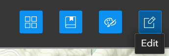
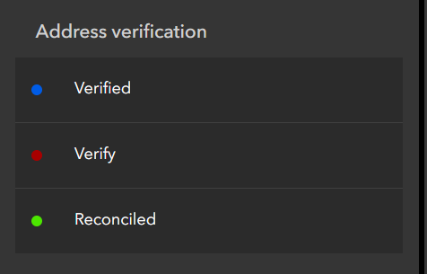
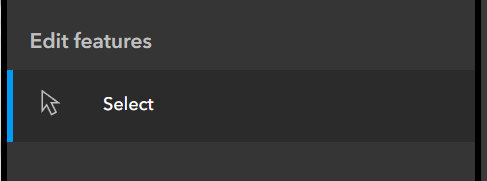

# Address Verification

Address verification refers to the process of ascertaining the _validity_, _accuracy_ and _completeness_ of our address database.

## Validity

> Is the address part of an approved use for the property?

When an address is for new development, the planner will approve the use of the property prior to requesting assignment. Establishing validity is more involved for older properties and existing addresses.
Converting a pre-existing building to expand occupancy requires approval from a planner, and the presence of addresses in use that are missing from our address records can indicate the presence of addresses that were not properly permitted.
For existing addresses, the planner will determine if the use is approved.
It is acceptable to add an address approved in this manner to our records.
When adding a pre-existing address to our records, we may waive the addressing fee in the interest of bringing our records up to date with existing conditions.

## Accuracy

> Does the address record match the displayed identification of the address in daily use?

Street imagery is the easiest way to verify the displayed identification on a structure. Google street view and Bing use independent imagery databases, so it can be helpful to check both when looking for identification. In addition to displayed identification, the following sources can serve as corollary identification:

- Mailboxes
- Waste/Recycling bin identifiers
- Curb numbers

When address identification is not visible in street imagery, conduct a site visit to verify the assignment is correct.

## Completeness

> Does the address database include all addresses in use within the area of interest?

Over time, the NENA standard used to format addresses for emergency response has imposed increasingly strict standards on the specificity of address assignments.
Where a single parent address may have been sufficient in prior years, today we record any subaddress identifiers associated with the parent address, including business suites, apartment units and even hotel rooms.
Many existing addresses in our records contain subaddress units that are not included in our address records because they predate the NENA requirements related to subaddresses.
These addresses sometimes appear in our business license database, at which point we may need to verify its presence and add the location to our records.

## The Address Verification Map

The Address Verification map is a tool for tracking the status of addresses during the verification process, and also serves as a host for institutional memory related to address assignment.

Here are links to resources related to the address verification map:

- ArcPro project location: O:\GISUserProjects\Users\ErikRose\address_verification\address_verification.aprx
- Service portal item page: [View](https://gisserver.grantspassoregon.gov/server/rest/services/Editing/address_verification/MapServer)
- REST Service endpoint: [View](https://gisserver.grantspassoregon.gov/server/rest/services/Editing/address_verification/MapServer)
- Web map template: [View](https://grantspassoregon.maps.arcgis.com/home/item.html?id=ee863ea743d94221abe0418b5162f6ef)
- Web map: [View](https://grantspassoregon.maps.arcgis.com/home/item.html?id=548d3528ceec4dd79a1c2af6afd16014)
- Web app item page: [View](https://grantspassoregon.maps.arcgis.com/home/item.html?id=1f740270187443f8adf5ab089bc22f6c)
- Web app service endpoint: [View](https://experience.arcgis.com/experience/1f740270187443f8adf5ab089bc22f6c)

As with other projects, we use the ArcPro project to publish a feature service to the internal portal.
We use the internal portal to publish the feature layer as editable, so that we can make changes to the layer in the field.
The web map _template_ is a web map that contains the target formatting for the address verification layer.
Refer to this template for formatting when using the `mapmakers` package to generate new web maps.
The next _web map_ item is a map generated from the template, used to populate the address verification web app.
The web app is the platform we use to make adjustments to the address verification layer in the field.

Since creating the map in February of 2023, we have added over 800 points to the address verification layer (as of September 2024).
As we verify addresses, attaching photo evidence of the identification, the verification map becomes an increasingly valuable resource for querying the history of particular addresses.
Often confusion over an address can spread to several agencies, and you will field the same questions about an address from different sources, months apart in time.
Being able to refer back to the records in the address verification map can save you time, and possibly an unnecessary site visit.

## Using the Verification Map

The purpose of the browser-based [web app](https://experience.arcgis.com/experience/1f740270187443f8adf5ab089bc22f6c) is to facilitate address verification in the field. To create a new entry, select the Edit widget from the widget controller panel:

Select the appropriate address point type, depending on your need:

When you create a new feature, the Edit window for the feature will open, allowing you to edit the values of the fields in the new feature.

- The _address_label_ field contains the existing address that we are trying to verify, and serves as the label in the verification map.
- The _notes_ field contains unstructured notes related to the verification.
- The _verify_ field controls the symbology of the feature.
  - _Verify_ - The address needs to be verified.
  - _Verified_ - The address has been verified by City staff, but not reconciled with the County.
  - _Reconciled_ - The address has been verified by City staff, and added to the County records.
- The _Attachments_ field permits adding photographs of address identification as attachments to their corresponding address points.
  - While photos are the most time-consuming element to collect in the field, they are often invaluable when returning to examine the data at a later time, and thus are the preferred means of recording address verification.

The additional fields present (id, latitude, longitude) were used to create the initial layer from a spreadsheet.

To change the field values of an existing verification point, use the Select tool. When the Select tool is active, a blue bar will appear on the left side:

## Conclusion

The Address Verification Map serves as the primary tool of the GIS Division for verifying addresses, and its introduction has helped to streamline the verification process for our staff.

Often, people will raise address issues in the course of other business, when we do not have time to follow up.
In these circumstances, we can now open the address verification map, place a quick point on the problematic location, and return to the issue later when there is more time.
After issuing a verification and making corrections to the City records, weeks or months may pass before ECSO will update their database.
The address verification map allows us to track cases where County action is still required, and makes it easier to follow up on cases that in previous years would fall through the cracks.
Finally, the address verification map serves as living memory, allowing us to revisit locations months or years later without the need of an actual site visit.
