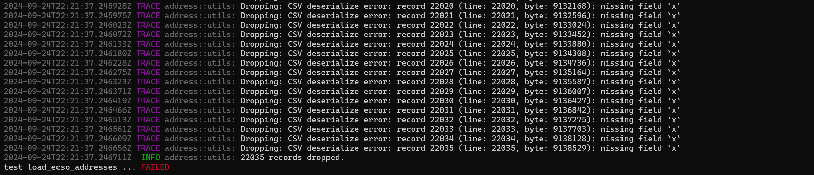
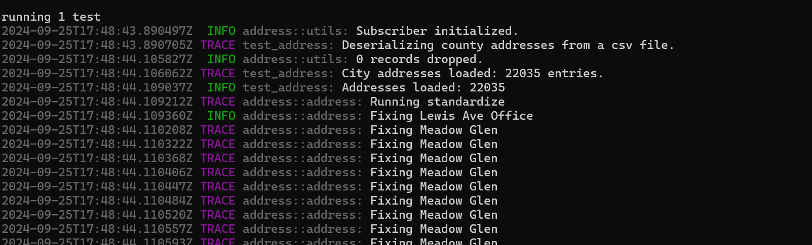

# The Address Management System

The program we use to organize address records uses the name Address Management System (AMS), based on the terminology in use by the USPS.

## Installation

The repository for the City AMS is [here](https://github.com/grantspassoregon/ams). Clone the repository to your local machine:

```{bash}
git clone https://github.com/grantspassoregon/ams.git
```

If you do not have _git_ set up on your machine, see [Github Integration](./github.md).

Run the program using _cargo_:

```{bash}
cargo run --release
```

The _cargo_ package manager is a part of the Rust programming language toolchain. If you do not have the Rust toolchain installed on your machine, see [instructions].

## The ArcGIS to Rust Bridge

ESRI uses proprietary data formats for geospatial data. In order to use open source tools on this data, we must first export it into an open source format. For point data, we use the `.csv` file format, because the spatial data (latitude and longitude) can be represented in columns using floats. For lines and polygons, we use shapefiles, because the import and export process using the `shapefile` crate was the first one we got to work smoothly.

The AMS expects all data to be in the EPSG-3857 projection (WGS 1984 Web Mercator Auxiliary Sphere). This is a current limitation of the GIS library we are using, and could be relaxed in the future. In ArcPro, we have been using EPSG-6826 (OCRS Grants Pass-Ashland NAD 1983 2011 TM (Meters)), so often you will have to reproject the data during export.

### Exporting Addresses

Address point layers in the AMS require two sets of coordinates, one in decimal degrees and one in geographic coordinates (in feet from a set reference point).
The county address record from ECSO includes longitude and latitude in decimal degrees, but not geographic coordinates, and the address layer from the city includes neither.
When we updated the address layer schema in 2023 for FGDC and NENA compliance, we elected not to add fields for coordinate data at that time.
If we do add coordinate fields to the address schema, then it would be preferable to calculate the coordinates on update using an attribute rule, so that new and changed addresses are automatically updated.
Currently, when we wish to export addresses, first we export the layer on our Enterprise database into a local geodatabase called "address_site_points.gdb".
We use the naming convention "county_addresses_YEARMONTHDAY" for county data and "city_addresses_YEARMONTHDAY" for city data.

Calculate the required coordinate fields using the "Calculate Geometry Attributes" tool.
Use the newly-created export as the Input Features. For City data, we will run the tool twice.
First, we will create a field called "latitude" with the property of "point-y coordinate" and another called "longitude" with the property of "point-x coordinate".
Set the Coordinate Format to Decimal Degrees, and the Coordinate System as EPSG-3857. Second, we will create a field called "x" with the property of "point-x coordinate" and a field called "y" with the property of "point-y coordinate".
This time we will set the Coordinate Format to Same as Input, leaving the Coordinate System as EPSG-3857.
The county data already has latitude and longitude fields, so we only need to run the tool once, creating the "x" and "y" fields using the Coordinate Format of Same as Input.

Once the coordinate fields are set, export the layer to `.csv` file by right-clicking on the layer in the Contents pane, and selecting Data > Export Table. Select a file location to store the file, and make sure to end the file name with `.csv`, or it will default to the `.dbf` format. Once you have exported the file to `.csv`, you can open it directly into the AMS using the Load widget.

#### Troubleshooting Address Import

The Load widget on the AMS will fail silently if there is a formatting issue with the data. If a row of data on the `.csv` does not match exactly the format of the expected address, the row will be dropped and the program will attempt to read in the remaining rows. To see which rows are being dropped, and why, we need to run the process in debug mode. If we were to run the AMS in debug mode, we would see a lot of logging information unrelated to the address import, and it could be difficult to wade through the extra information. Instead, try modifying the tests in the `address` crate, and run these tests directly, setting the log level to TRACE.

Here is a modification of the test for loading county addresses, _load_ecso_addresses_:

```{rust}
#[test]
#[cfg_attr(feature = "ci", ignore)]
fn load_ecso_addresses() -> Clean<()> {
    utils::trace_init();

    trace!("Deserializing county addresses from a csv file.");
    // I have commented out the original file path and added the current file that is giving me trouble.
    let file = "c:/users/erose/documents/county_addresses_20240924.csv";
    // let file = "tests/test_data/county_addresses_20240626.csv";
    let addresses = JosephineCountySpatialAddresses2024::from_csv(file)?;
    // I also have commented out the assertion test here.
    // assert_eq!(addresses.len(), 45252);
    trace!("City addresses loaded: {} entries.", addresses.len());
    let mut spatial = SpatialAddresses::from(&addresses[..]);
    info!("Addresses loaded: {}", spatial.len());
    spatial.standardize();
    // I do not want to save and overwrite the old data until I know it works.
    // spatial.save("tests/test_data/county_addresses.data")?;
    // let addresses = GrantsPassAddresses::from_csv(file)?;
    // assert_eq!(addresses.records.len(), 27437);
    Ok(())
}
```

In this example, I have changed the file path to point to the target import data that is not reading in properly. I have commented out the parts of the test that compare the number of addresses to a known count and save the results.

The default log level is INFO, so to get TRACE-level data we have to adjust the log level by modifying the appropriate environmental variable. In the Powershell terminal, enter:

```{bash}
$env:RUST_LOG="trace"
```

Now you can run the test by entering:

```{bash}
cargo test load_ecso_addresses -- --show-output
```

If you forget to add the "x" and "y" geographic coordinate fields to the county address data, the log output will look like this:



For each field of address data that the program expects to be present, the program looks for an appropriately-named column in the spreadsheet for a match. If a match is not present, it will drop the row and log the issue. In this case, the first field that failed to match is the "x" coordinate. If any field is missing, the row will be dropped. Since all rows are missing the "x" field, all rows are dropped and the read fails.

In the example below, the "x" and "y" fields are present. We can see that zero records are dropped, and all records have successfully loaded. In the logs, we can see the program proceed to the next step in the test, standardizing address formats between the City and the County. When your output looks like this, then you should be able to open the `.csv` file successfully within the AMS using the Load widget.


