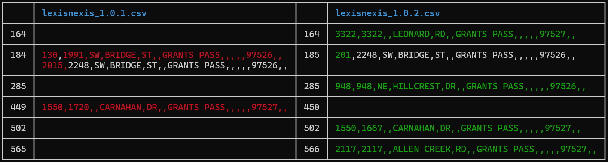

# LexisNexis

LexisNexis provides a third-party service to emergency dispatch, allowing officers to file an automated ticket for events that they are unable to follow up on with a site visit. The function of the LexisNexis table is to provide a lookup mechanism to easily determine the applicable service area for the call. The service area is either within GPPD or without.

Areas within the GPPD service district include:

- Inside City Limits
- Properties outside city limits with a public safety agreement in place.

The LexisNexis table can change whenever we add new addresses, annex a property into the City Limits, or enter in a public safety agreement with a property outside of the City Limits.

Currently the easiest way to generate the LexisNexis table is from the AMS. Here are the instructions to load the applicable data into the AMS:

- Export the Addresses layer to .csv
  - Export a copy of the Address layer to the local project GDB.
    - In the Environments tab, set Output Coordinate System to WGS 1984 Web Mercator (auxiliary sphere).
  - Use the Calculate Geometry Attributes tool to generate coordinates:
    - longitude - Point X in decimal degrees.
    - latitude - Point Y in decimal degrees.
    - x - Point X using Same as Input.
    - y - Point Y using Same as Input.
  - Export the feature layer to .csv file using "Export Table".
- Export the City Limits layer to shapefile.
  - Use the polygon layer GPGIS.reg_CITYLIMITS
  - Use the Feature Class to Shapefile tool.
  - In the Environments tab, set Output Coordinate System to WGS 1984 Web Mercator (auxiliary sphere).
- Export the Public Safety Agreements layer to shapefile.
  - Use the polygon layer GPGIS.plan_SERVICEANNEXATIONAGREEMENTS
  - Use the Feature Class to Shapefile tool.
  - In the Environments tab, set Output Coordinate System to WGS 1984 Web Mercator (auxiliary sphere).

If one of the applicable layers has not changed since the last time, the file does not need to be re-exported.

Be sure to change the projection of the exported layers to WGS 1984 Web Mercator (auxiliary sphere). The field names in Addresses needs to match the values listed, namely "longitude", "latitude", "x", and "y".

The scripts for reading .csv and shapefile formats into the AMS is within the `tests` folder. Eventually, the goal is to move these capabilities out into the user-facing API. The `tests` folder is located in the main repo directory [here](https://github.com/grantspassoregon/ams/tests/test.rs). To read in new data, you will modify the file path of the appropriate tests:

From test.rs lines 48-55:

```{rust}
fn city_addresses() -> Clean<SpatialAddresses> {
    let addr = address::import::GrantsPassSpatialAddresses::from_csv(
        // Modify the path here to match the new file location
        "c:/users/erose/repos/address/tests/test_data/city_addresses_20240905.csv",
    )?;
    let addr = SpatialAddresses::from(&addr[..]);
    addr.save("data/addresses.data")?;
    Ok(addr)
}
```

From test.rs lines 84-97:

```{rust}
fn lexis_nexis_boundary() -> Clean<Boundary> {
    info!("Reading city limits.");
    // Modify the path here to match the new file location
    let cl = Boundary::from_shp_z("c:/users/erose/geojson/city_limits.shp", "City Limits")?;
    info!("City limits successfully read.");
    info!("Reading public safety.");
    let ps = Boundary::from_shp(
        // Modify the path here to match the new file location
        "c:/users/erose/geojson/public_safety_agreement.shp",
        "Public Safety Agreement",
    )?;
    info!("Public safety agreements successfully read.");
    let ln = Boundary::new("Lexis Nexis Boundary", cl.geometry.union(&ps.geometry));
    ln.save("data/lexis_nexis_boundary.data")?;
    Ok(ln)
}
```

Note that these functions update two saved files within the repo: "addresses.data" and "lexis_nexis_boundary.data". These files are in a binary format that loads quickly into the AMS.

Now you can start the AMS by navigating the AMS repo on your machine and entering:

```
cargo run --release
```

1. Load the address targets into the system:

- Click the Load button.
- Navigate to the target file and click Open.

2. Click the LexisNexis button.

- Check to ensure the correct layer is selected as the address source.
- Click Run.
- When the table completes building, click Save to export as a .csv.

Navigate to the [lexisnexis](https://github.com/grantspassoregon/lexisnexis) repo. Observe the current version level of the most recent lexisnexis table. Version numbers consist of three levels: MAJOR.MINOR.PATCH. Bump the patch version number by 1 for normal table updates. If you change the scheme of the table, bump the minor version. If LexisNexis changes their format and you have to redo everything, bump the major version. Save the new version in the repo with the bumped version number. For instance, if the previous version was "lexisnexis_1.0.9.csv", the new version would be "lexisnexis_1.0.10.csv".

From the terminal, use `prettydiff` to produce a diff report. From the root of the lexisnexis repo, enter the command:

```
prettydiff lexisnexis_1.0.OLD.csv lexisnexis_1.0.NEW.csv
```

If you do not have this program installed, you can obtain it from cargo by running:

```
cargo install prettydiff
```

The diff report will look something like this:



```

```
