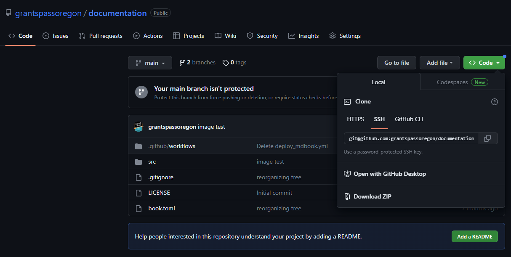
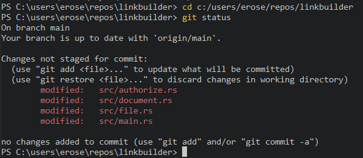
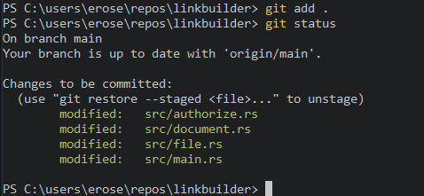
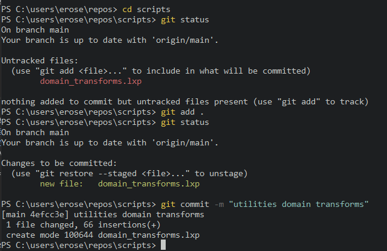
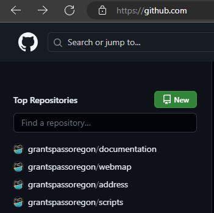
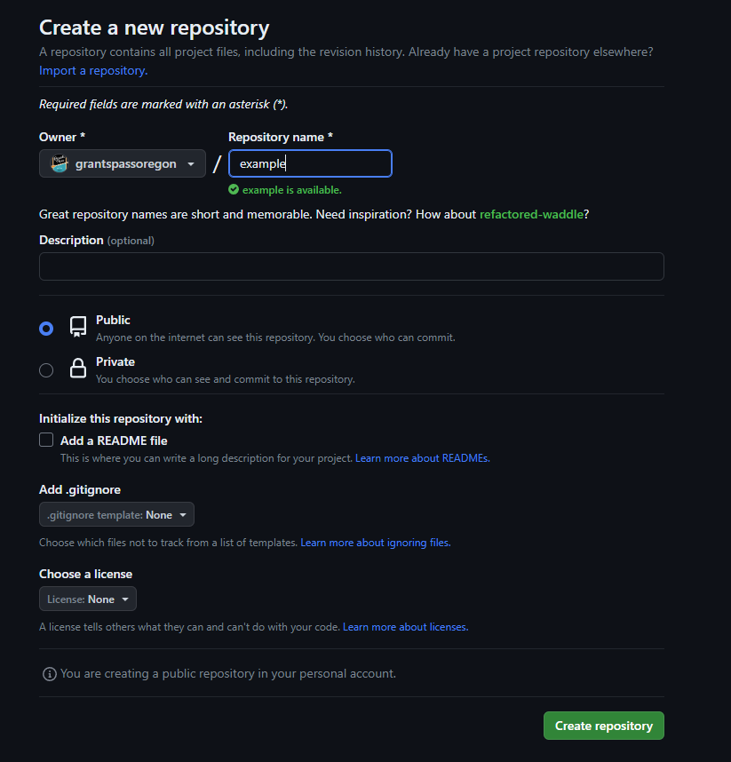
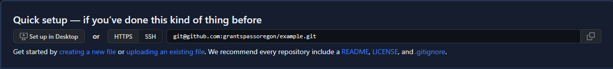

# Using git

This section describes how to use `git` commands to download code from the GitHub repository onto your local machine, make changes to this code and then upload these changes back onto the repository, as well as how to make a new repository and associate it with the GitHub account.  We introduce the most common commands that you will use to manage the code base.  Although `git` offers many additional features, and you are welcome to use these features to improve your productivity, the following commands should be sufficient for a new user to set up a basic workflow.

## Cloning a Repository (git clone)

GitHub offers centralized cloud-based code storage that allows users of an organization to collaborate across multiple locations.  Changes made to the code from an individual computer synchronize the with the centrally-stored code database, ensuring that all users are able to access a shared version.  The first step in gaining access to the shared code is to make a local copy of the relevant GitHub project onto your local machine, a process called "Cloning a Repository."

The City of Grants Pass organizational account is located at [https://github.com/grantspassoregon/](https://github.com/grantspassoregon/). This account hosts projects related to the GIS Division.  Each project is an independent repository that you may elect to download to your local machine.  If you select a repository by clicking on its link, the file tree of the main branch will load onto the screen.  Clicking on the green `<> Code` button displays a dropdown field showing the download path to use in order to clone the repository.  The image below shows the download path to the `documentation` repository, which holds the source for this markdown book.



Running the `clone` command will download and install the specified code into the current working directory.  You may wish to create a dedicated directory on your machine for storing repositories on your system, such as a `repos` directory in `C:\Users\%Username%\`.  First, navigate to this directory in the terminal:

```
  cd c:/users/%Username%/repos
```

Then make a local copy of the selected repository, in this case `documentation`, using the `clone` command:

```{bash}
git clone git@github.com:grantspassoregon/documentation.git
```

This command will create a folder with the same name as the project in the working directory.  You can view the downloaded files by navigating into the directory (e.g. `cd documentation`) or by opening the files directly into your favorite code editor.

## Updating Your Local Version (git pull)

The command `git pull` is a way to sync the copy of the code base on a local machine with the latest changes made to the remote repository.  If some time has passed since you cloned a repository on your local machine, or if the project is in active development by a colleague, then you may need to run `git pull` in order to update your local copy to the most recent version.  When executed from the working directory of a git project, `git pull` will download the latest changes on the remote repository and update the local copy. If you plan on making changes to a code base that is actively under development by multiple people, it is wise to `git pull` before you begin editing, to prevent potential merge conflicts.

A typical use pattern for this command looks like this:
```{PS}
> cd path\to\project
> git pull
```

## Examining the Project Directory (git status)

The `git status` commands tracks changes made to files tracked by git.  When you edit a local file in the repository, `git status` will show the file to be changed but not "staged".  Staged changes are edits that you explicitly want to push up into the remote branch.  You can stage changes for committing to the remote branch using the `git add` command.  Running `git status` is a good way to ensure that all changes made during an editing sessions are properly staged before attempting to commit to a remote repository.



## Staging Changes to Commit to a Remote Repository (git add)

The `git add` command promotes changes in your local files to the staging area.  Only staged files are pushed to the remote repository during a commit.  If you only want to stage a single file from your local machine, you can specify the file name:
```{PS}
# stage a single file
> git add address.rs
```

If you want to add all changes made to the staging area, you can use to dot operator "." or the -p flag, short for "patch":
```{PS}
# stage all changes
> git add .
# or, alternatively
> git add -p
```

When you create a new file name that is not stored on the remote repository, this file begins as "untracked".  When you add the file to the staging area, it becomes "tracked".  If you want to ignore new files (maybe they are not ready yet) and only stage changes made to files that are already tracked, use the -u flag, short for "update", which will only stage files that have a matching entry in the remote repository:
```{PS}
# stage tracked changes
> git add -u
```

After staging changes, it is helpful to run `git status` to ensure the staging area is correct before committing changes to the remote repository:


## Commit Staged Changes to a Remote Repository (git commit)

When you are ready to commit staged changes to a remote repository, use the `git commit` command.  Industry best practice includes attaching a short descriptive message to a commit.  This message makes it easier to understand the purpose of the committed code without wading through it line by line.  When searching through the past history of commits, a good message can make it easier to find the change you are looking for.  To include a message, using the -m flag and pass the message inside quotes, so the format of the command looks like this:
```{PS}
> git commit -m "descriptive message"
```


## Pushing Committed Changes to a Remote Repository (git push)

The `git push` command is the final step in moving changes from your local machine to a remote repository.  You can edit and revise your work, and make multiple calls to `git commit`, but until you run `git push`, these changes will remain confined to your local machine.  Generally, it is good practice to commit stable changes regularly to the remote repository, to serve as a backup if something happens to your local machine.  In addition, the more commits stack up on your local machine, the greater the risk of merge errors when you finally do run `git push`, and the best way to handle merge errors is to avoid having them occur in the first place, so push often.


## Adding Locally-Hosted Code to a New Repository

As the scope and duties of the GIS Division change over time, we create new projects to meet the changing needs of the City government. The easiest method to add a new project to the GitHub account is to begin with code hosted on your own machine, and then to push this code into an empty repository on GitHub using the CLI.
Referring to the [docs](https://docs.github.com/en/migrations/importing-source-code/using-the-command-line-to-import-source-code/adding-locally-hosted-code-to-github):

* Create a new repository on GitHub.com.
  * Click the new repository button:
  
  * Enter the name of the new project:
  
  * Unless there are overriding privacy concerns, a Public repository is standard.
  * Do not initialize the new repository with a README, license, or gitignore files.  Leave it empty.
  * An empty repository prevents merge errors when uploading the code hosted on the local machine.
* At the top of the new Quick Setup page for the new repository, copy the remote repository URL.
  
* Open Git Bash or the Alacritty terminal and navigate to the local project directory.
  * Ensure that the local repository is committed and ready to push.
    * If the code is not set up as a git repository, run `git init`.
    * Run `git status` and add any outstanding changes using `git add .`.
    * Commit the changes using `git commit -m "descriptive message"`.
* Link the local directory to the remote repository:
  ```{bash}
  # replate <remote-URL> with the URL copied from the Quick Setup page on GitHub.com
  git remote add origin <remote-URL>
  # change the default branch name to "main"
  git branch -M main
  # push the contents of the local directory to the remote repository
  git push -u origin main
  ```

