# Utility Network Creation

## Initial Setup

- In the Project/Package Manager window, create a clone of the active environment if you have not already, and switch to the new environment (restart required to take effect).
  - Select "Add Packages", search for "untools" and install the package into your environment. This package includes the Data Loading Tools that we will be using to import the data from our old network into the new.
- Start a new project in ArcGIS Pro, e.g. "stormwater_pilot".
- Download the latest version of the Stormwater Utility Network Foundation on the ESRI [Solutions](https://grantspassoregon.maps.arcgis.com/apps/solutions/index.html?searchTerm=stormwater%20utility%20network%20foundation&sortField=relevance&sortOrder=desc#home) page and move the contents into the project folder.
- Create a new file GDB in the project folder to hold a local copy of the old network (e.g. "stormwater_gn").
- Export the old network to the file GDB.
  - Check the transfer fields and domain properties boxes in the environment dialogue to include domains.
  - Check the box to keep Global IDs from the source layers.
  - Change the spatial reference to OCRS Grants Pass (meters).
  - Check that the domains on the FGDB match the GN, so the DLT can read the domains.

### Keep a Clean Backup Set Up For Data Loading

- Copy the foundation asset package (e.g. ./StormwaterUtilityNetworkFoundationV1_4/Stormwater_AssetPackage.gdb)
  - Run the "Change Asset Package Spatial Reference" to set the spatial reference as OCRS Grants Pass.
    - Running this tool creates a copy of the target, which I put in "./asset_package/clean_ocrs.gdb".
- Adjust the domains, such as Owner and Lifecycle, to include values from our data, such as City of Grants Pass.

### Set the Service Territory

- The UN requires a service territory to be defined, which is a boundary that must contain all the assets to be added now and in the future. For a service territory, I use the watershed boundary that encompasses Grants Pass and Medford, so that the service territory is larger than we will need even if we grow exponentially during my lifetime. The easiest way to accomplish this is to open the asset package or UN for the stormwater migration and copy the Service Territory feature class from this project, then write over the existing ServiceTerritory feature class in the UtilityNetwork dataset within the asset package that you have just created.
  - Copy an existing Service Territory (from the wastewater or stormwater pilots) into the UN.
    - Do this after changing the spatial reference (my service territory got deleted by the change, so I had to add it again).

### Stormwater Valves

Our stormwater layer includes GPID assets that use valves for flow control. While valves are standard devices in water distribution, the stormwater utility network foundation does not include a valve among its default presets, so we must add the valve type manually to the utility network configuration.

- Add an irrigation valve type to the clean_ocrs asset package, so the valve type is available on future transformations.

- From <https://pro.arcgis.com/en/pro-app/latest/help/data/utility-network/configure-a-utility-network.htm>

- Use the Add Subtype tool to create a new Asset Group type for Stormwater Device ("Valve").
- Create a Domain to represent the asset type.
  - Include a 0 - Unknown option to satisfy the default value.
  - Include an Irrigation Valve (I mapped it to 500 to avoid conflicts with other asset types).
- Use the Assign Domain to Field tool to associate the domain with the asset type for valves.
  - Select Stormwater Device, and the asset type field.
  - Check the valve subtype in the list of subtypes.
    \_ Use the Add Terminal Configuration tool to create a directional terminal for the Valves type.
  - from <https://pro.arcgis.com/en/pro-app/3.3/help/data/utility-network/about-terminal-management.htm#GUID-40F2CF0E-130D-4A58-A927-18B959FB663C>
  - Might be able to reuse the configuration for outlets instead (Directional Dual Terminal).
- Use the Set Terminal Configuration tool to assign the new terminal configuration to the Valves type.

Previous instructions from Robert Krishner:

1. Add an integer field to the valve layer to represent the valve status.

- Use a short integer type.

2. Assign a domain to the device status field to represent the open/closed state.

- Our source data for stormwater valves includes a "CURROPEN" field indicating 1 for open and 0 for closed, but it is not set to a domain.
- Use Calculate Field to map the integer values in CURROPEN to domain values in the new field.

3. Add a new network attribute to the B_NetworkAttribute table.

- Use the Add Network Attribute tool in the Geoprocessing pane.
- Specify the stormwater utility network as the Input Utility Network.
- Choose a name for the valve attribute (e.g. "Valve").
- Choose a short integer for the Attribute Type.

4. Assign the new network attribute to the field using the B_NetworkAttribute_Assignment table

- Use the Set Network Attribute tool in the Geoprocessing pane.
  - Use the stormwater network for the Input Utility Network.
  - For the Network Attribute, select Valve.
  - Choose the Stormwater Domain Network and not the Structure network.
  - For Input Table, select StormwaterDevice.
  - For Field, select the field source for the subnetwork controller, in my case "valve_status".

5. Teach your subnetworks to treat closed valves as barriers by adding a condition barrier to each tier of your network in the B_Subnetwork_ConditionBarriers table

- Set up the terminal connect for the valve:
  - Use the Add Terminal Configuration tool. (Can be skipped, just use the pre-existing Direction Dual Terminal configuration.)
    - Use the stormwater network for the Input Utility Network.
    - Enter a controller name in the Name field.
    - Specify Directional in the Directionality field, so the terminal can serve as a subnetwork controller.
    - Specify two terminals, one representing an open valve and the other representing closed.
    - Leave the Valid Paths fields empty, they are intended to disambiguate between three or more terminals.
    - Leave the Default Path as All, meaning all terminal states are valid.
  - Use the Set Terminal Configuration tool to assign the terminal configuration to the stormwater valve type.
    - Use the stormwater network for the Input Utility Network.
    - Select Stormwater for the Domain Network.
    - For Input Table, select StormwaterDevice since valves were imported as Pipe Connections.
    - For Asset Group, choose Connection.
    - For Asset Type, select the valves, in my case titled Stormwater Valve.
    - For Terminal Configuration, select the terminal just created for the Stormwater Valve.
  - Use the Set Network Category tool to categorize the valve as a subnetwork controller.
    - Use the stormwater network for the Input Utility Network.
    - Select Stormwater for the Domain Network.
    - For Input Table, select StormwaterDevice since valves were imported as Pipe Connections.
    - For Asset Group, choose Connection.
    - For Asset Type, select the valves, in my case titled Stormwater Valve.
    - For the Categories section, in the first field select Subnetwork Controller.
- Use the Set Subnetwork Definition tool to add the subnetwork controller to the subnetwork definition.
  - Specify the stormwater utility network as the Input Utility Network.
  - Choose the Stormwater Domain Network and not the Structure network.
  - For Tier Name, select the desired tier, in my case there is only one available.
    - Leave the Support Disjoint Subnetwork box checked.
  - In the Subnetwork Diagram Templates section, select the desired diagram template.
    - The help documentation recommends against using the default template options for subnetworks, so I created a custom template for valves.
  - Under Valid Features and Objects, in the section called Valid Device Subnetwork Controllers, add the Connection/Stormwater Valve type to the list of valid controllers.
  - Under Condition Barriers, click the Add Another button.
    - For Name, select Valve, or the name you have assigned to the controller.
    - For Operator, select "Is equal to".
    - For Type, select "Specific Value".
    - For Value, select 0 or Closed.
    - For Combine Using, select Or.
- Add rules to allow connectivity to the controller.
  - Use the Add Rule tool in the Geoprocessing pane.
  - Example rule for gravity mains:
    - Set Input Utility Network to the Stormwater Network.
    - Select Junction-edge connectivity for the Rule Type.
    - Set the From Table to StormwaterDevice.
    - Set the From Asset Group field to Connection.
    - Set the From Asset Type field to Stormwater Valve (the name of the controller type)
    - Set the From Terminal field to ALL, so the pipe can connect to either terminal.
    - Set the To Table field to StormwaterLine.
    - Set the To Asset Group field to Pipe.
    - Set the To Asset Type field to Gravity Pipe.

### SS Catchbasin

The wastewater network includes grease traps and oil water separators that feed from catchbasins. To distinguish these catchbasins from the many that participate in the stormwater network, we will make a catchbasin type unique to the wastewater network.

- Use the Add Subtype tool to create the Catchbasin type within the Sewer Device subtype layer.
- Create a domain to represent the subtypes of catchbasins:
  - 0 = Unknown
  - 500 = Catchbasin
    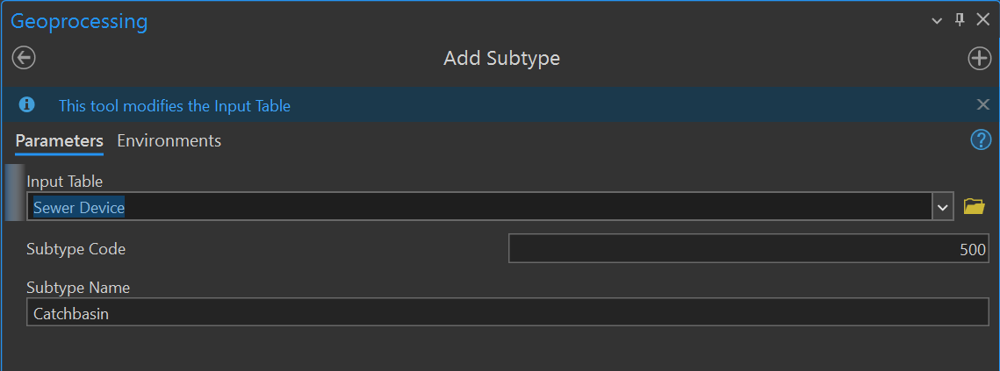
- Use the Assign Domain to Field tool to associate the domain with the subtype asset:
  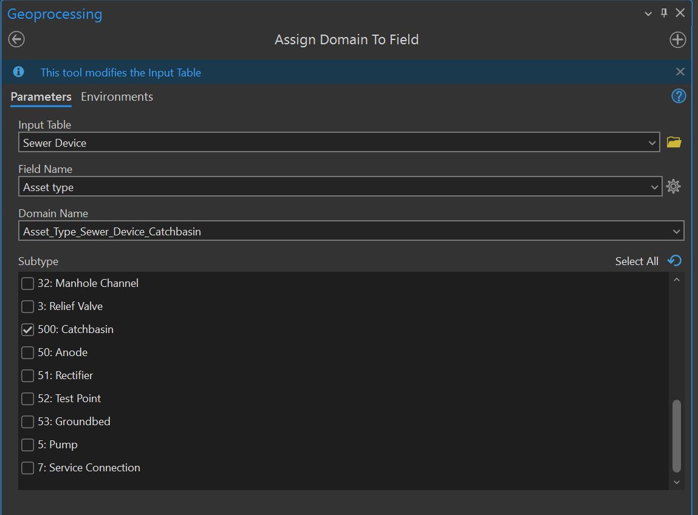

## Data Loading Tools

- Run Create Data Loading Workspace from the DLT folder.
  - Select each layer in the GN for source layers.
  - Select the appropriate analog in the asset package for the target.
  - Creates a folder called "DataLoadingWorkspace".
    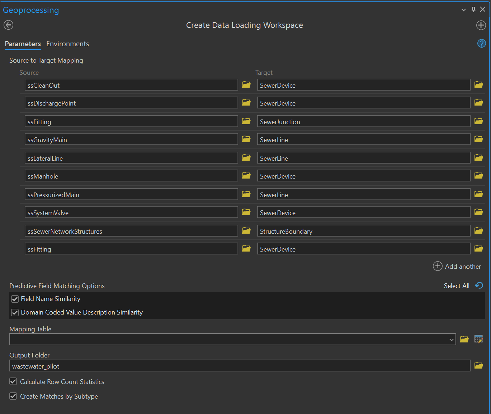
    Note that we read from the fitting layer for wastewater twice, once for SewerJunction assets and once for SewerDevice assets.
- Update target domains.
  - Add missing domain variants to the asset package.
  - Check field mapping and fix scrambled imports.
  - Adjust maps from old domains to new domains (asset_owner, asset_status, data_source, etc.)
- Add missing fields to the AP that you want to import from the GN.
  - Also add these fields to the correct asset worksheet
- The Target column in DataReference.xslx specifies the asset package into which we are loading the data (e.g. "working_ap").
- Run "Load Data Using Workspace" from the DLT folder.
  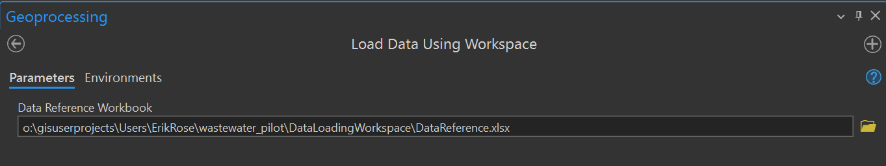

## Convert Asset Package to Geodatabase

- In the Geoprocessing pane, search for the tool "Asset Package to Geodatabase".
  - For "Asset Package", select the asset package modified by the "Load Data Using Workspace" tool.
  - The "Service Territory Feature Class" field should populate with the ServiceTerritory polygon that you have added to the asset package, but you can navigate manually to this feature if it does not.
  - The "Workspace Type" should be "File Geodatabase"
  - The "Folder Location" specifies the directory where the newly created GDB will be stored.
  - The "Geodatabase Name" field specifies the file name of the new GDB.
  - The "Feature Dataset Name" is the name of the feature dataset containing the utility network within the GDB.
  - The "Utility Network Name" will be the name of the utility network used by assets within the dataset.
    - Spaces in the name are replaced by underscores, and the string " Utility Network" is appended to the end of the name.
      So "Wastewater Network" becomes "Wastewater_Network Utility Network", and "Wastewater" becomes "Wastewater Utility Network".
  - Within "Asset Package Options", make sure the Post Process box is unchecked. Although it claims to be unchecked by default, I find that it is checked by default on my machine and needs to be unchecked manually before executing.
    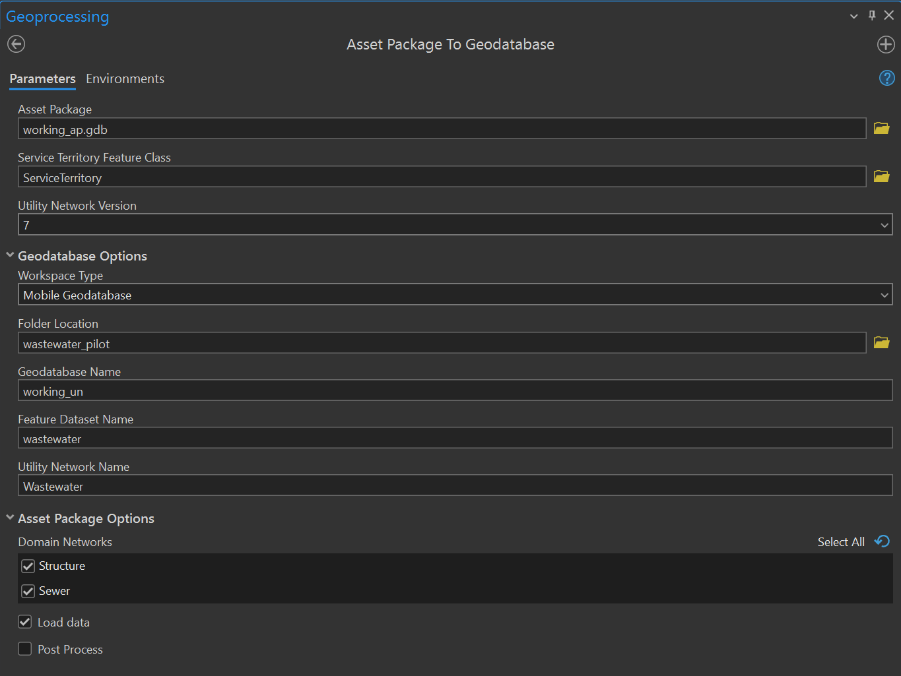

## Clear Network Connectivity Errors

- In the Geoprocessing pane, search for the tool "Enable Network Topology" from the Utility Network toolset. Beware that there is an identically named tool in the Trace Network toolset that you _do not want_.
  - CAUTION: You must check the box "Only generate errors". There are configuration changes that you can only make before Network Topology has been enabled, and often you won't know what those are until you start resolving connectivity errors, so you are going to run Enable Network Topology to generate the errors without actually enabling the network.
  - The initial import may contain more than 10000 errors, so delete this number and leave the "Maximum number of errors" field blank, which will not put a cap on errors.
    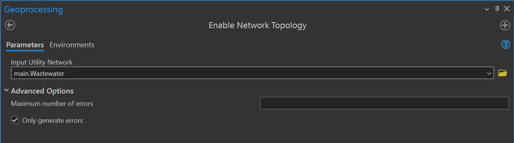
- The network errors layer does not have a simple way to display errors. If you turn on labeling, the default errormessage field will give the integer code associated with an error, which will likely not be enough to go on, especially at first. So instead, I recommend copying the method employed in the online tutorial [Fix connectivity errors in a utility network](https://learn.arcgis.com/en/projects/fix-connectivity-errors-in-a-utility-network/).

  - Download the [tutorial project](https://www.arcgis.com/sharing/rest/content/items/fe8f6832bcd74bde9118e54afe18951d/data) and open it in ArcGIS Pro.
  - In the Contents pane, expand the "Water Utility Network" category, right-click on "Dirty Areas" and select "Labeling Properties..." from the context menu.
  - Copy the expression in the "Expression" field and paste it into the "Expression" field for the dirty areas labeling in your network import, and click apply.

- Add rule to connect manholes to lateral lines.

## Export Asset Package

Now that we have created a fully-functional utility network, we are going to turn it back into an asset package that includes all our changes.

- Run the Export Asset Package tool.
  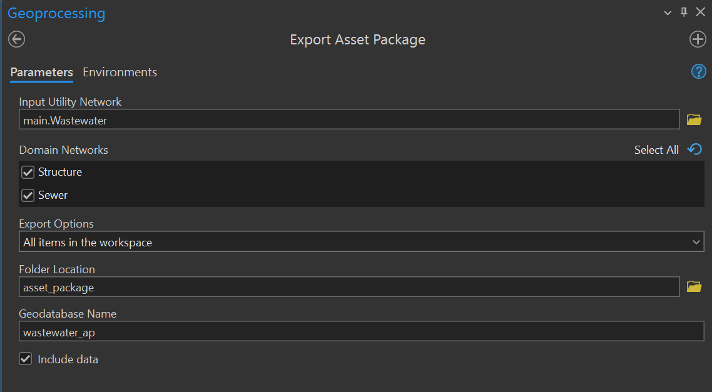

## Deploying a Utility Network

Here is a link to the [video](https://mediaspace.esri.com/media/t/1_7afu0n8p/246131802).

- The Pro project includes a Tasks folder. Select the Tasks folder from the Contents pane, and open the folder labeled "Deploy Solution to an Enterprise Environment"
- To create the network, your user permissions must be at least Creator (or GIS Professional), with publishing permissions. You must have the license for ArcGIS Utility Network.
  - You may want to create a headless user responsible for managing the UN, instead of creating it under your own personal user account.
- Create an Enterprise Geodatabase
  - Instance is the machine name
    - Use SQL Management Studio to inspect the instance name (e.g. "OUTRIGGER\COGP_GIS")
  - Need database admin user and password
    - I created the database using my normal login (PACIFIC\erose), using operating system authentication.
  - Need ArcGIS Server license file
  - The process reported failure, but the database got created.
    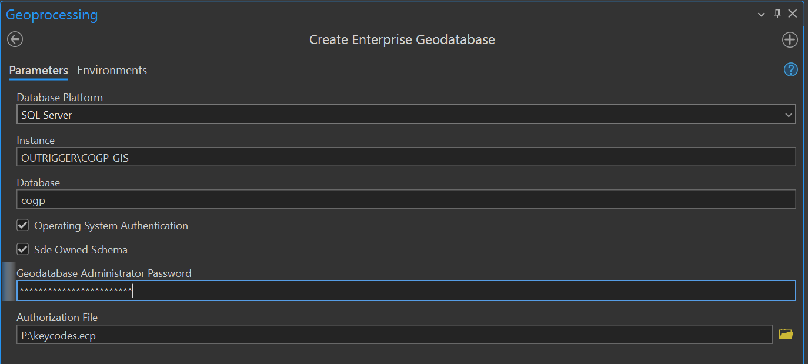
- Create an Admin Database Connection
  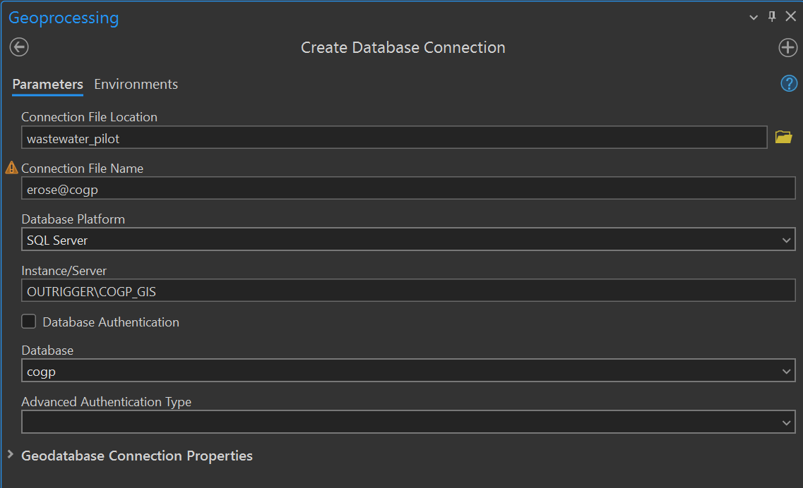
  - Right-click on the connection file in the Catalog Pane and select Enable Enterprise Geodatabase.
    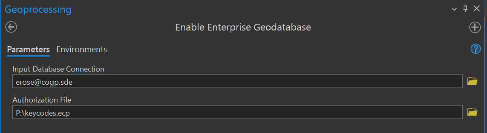
  - Right-click on the connection file in the Catalog Pane and select Geodatabase Connection Properties.
    - Select Branch versioning and press OK.
      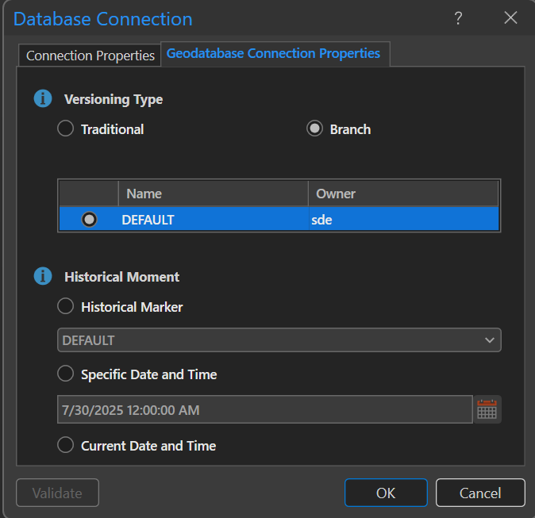
- Create Database User
  - E.g. wastewater | stormwater
    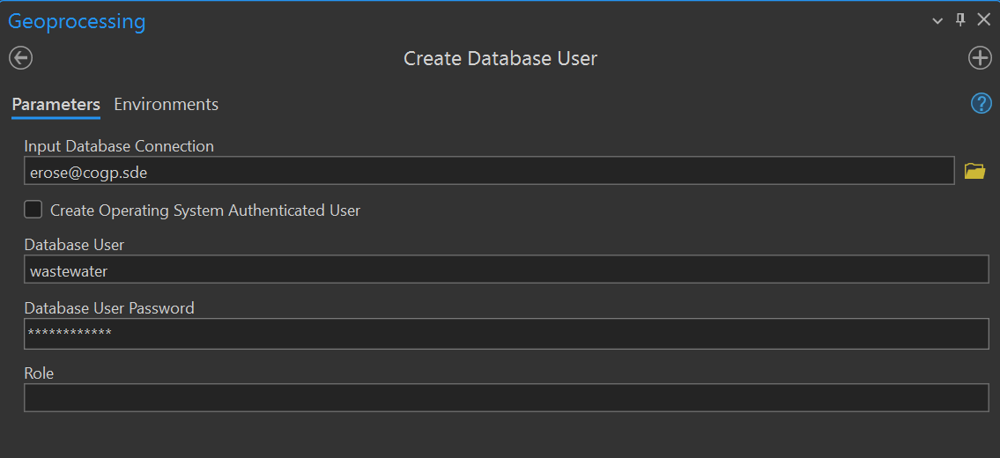
- Create Network Owner Database Connection
  - You can change the password of the user in SQL Management Studio.
  - Set the authentication to database (not OS), use the user name and password.
  - Note the username and password for future reference.
    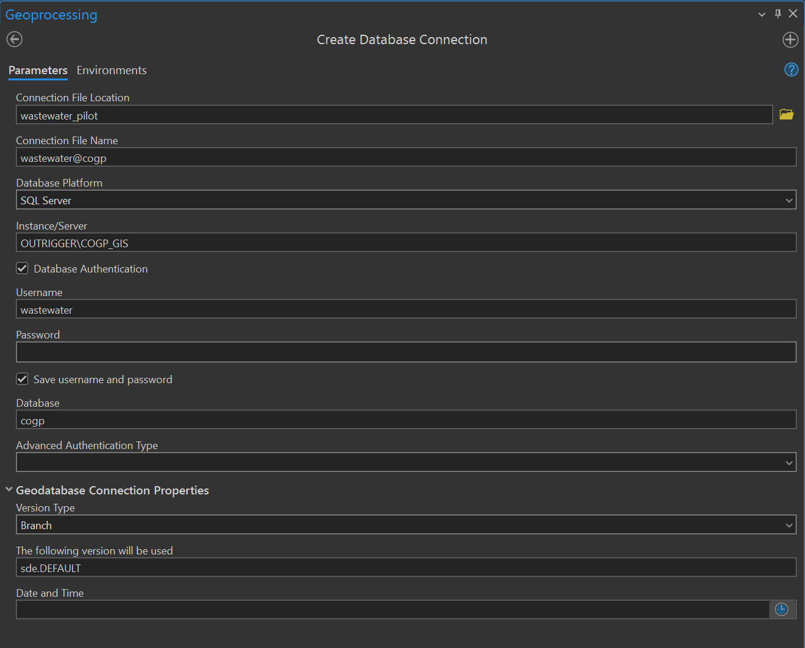
- Create the Utility Network
  - Run the Stage Utility Network tool.
  - Use the UN Owner user, not the Admin
    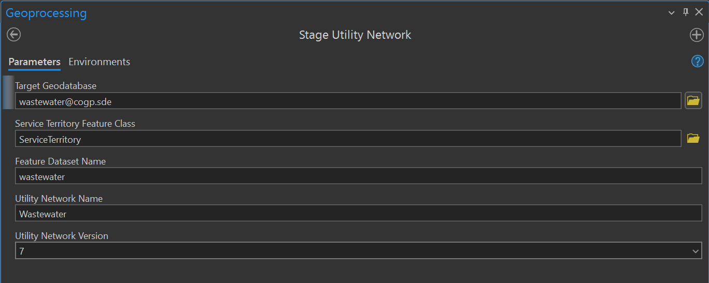
- Migrate the data using Data Loading Tools
  - Run the Apply Asset Package tool.
    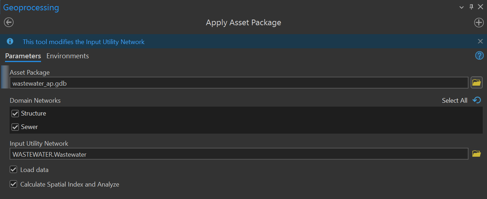
  - Set versioning for the utility network layers to Branch and enable replica tracking.
    - Refresh the database connection to see Validation layers, which also need replica tracking.
  - Enable Network Topology for the branched version.
    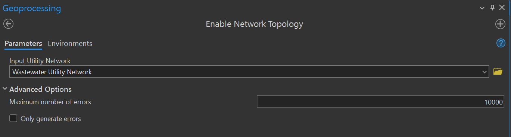
- Publish the network as a feature service.
  - Drag the network layers into a map. Do not apply any symbology.
  - Register the data source with the server.

## Trace Configuration

- Run the Add Trace Configuration tool to create Upstream and Downstream named traces for the network.
  - Use Digitized Direction
  - Include containers
  - Include Content
  - Include Barrier Features
  - Validate Consistency
  - Allow Indeterminate Flow
- Test the traces in the ArcPro project, adjust as needed. Network topology must be enabled to run traces.
- Activate Named Trace Configurations in the Network Options panel of the Share pane.
  - Ensure the UN layer is added to the map, not just the point and line layers associated with it.
  - Select the Utility Network Ribbon and click the expansion button on the tools panel.
  - Click the Sharing tab and check the named traces to add to the webmap.

## Attribute Rules

- Change the prefixes for asset types in the \*-GenerateIDs family of attribute rules.
- Use the file utility_id_matrix.xslx to refer to the desired target prefixes.
